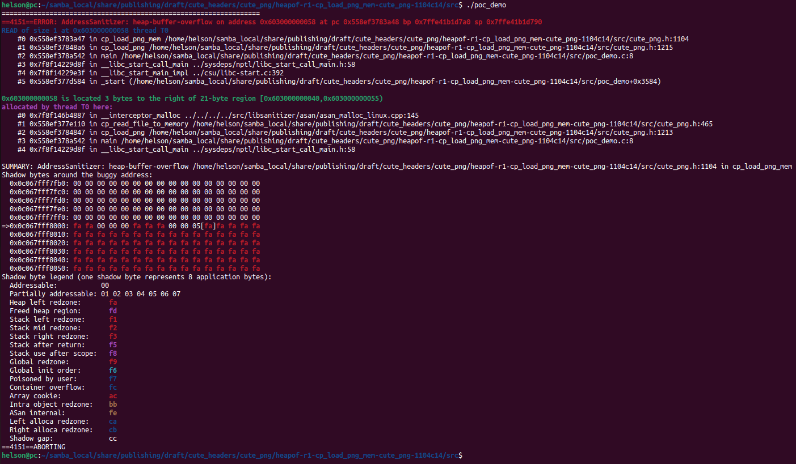

# Description

Heap-buffer-flow bug/vulnerability caused by read access found in function cp_load_png_mem() at line 1104 of cute_png.h v1.05.

Affected version: cute_png v1.05


# Reproduction

Environment:


Operating system version: Ubuntu 22.04


Linux kernel version: Linux pc 5.19.0-41-generic #42~22.04.1-Ubuntu SMP PREEMPT_DYNAMIC Tue Apr 18 17:40:00 UTC 2 x86_64 x86_64 x86_64 GNU/Linux


Compiler version: gcc version 11.4.0 (Ubuntu 11.4.0-1ubuntu1~22.04)


Run the following command in bash shell:

```shell
#!/bin/bash 
pushd src
make
./poc_demo
```


# Screen-shot




```shell
=================================================================
==4151==ERROR: AddressSanitizer: heap-buffer-overflow on address 0x603000000058 at pc 0x558ef3783a48 bp 0x7ffe41b1d7a0 sp 0x7ffe41b1d790
READ of size 1 at 0x603000000058 thread T0
    #0 0x558ef3783a47 in cp_load_png_mem /home/helson/samba_local/share/publishing/draft/cute_headers/cute_png/heapof-r1-cp_load_png_mem-cute_png-1104c14/src/cute_png.h:1104
    #1 0x558ef37848a6 in cp_load_png /home/helson/samba_local/share/publishing/draft/cute_headers/cute_png/heapof-r1-cp_load_png_mem-cute_png-1104c14/src/cute_png.h:1215
    #2 0x558ef378a542 in main /home/helson/samba_local/share/publishing/draft/cute_headers/cute_png/heapof-r1-cp_load_png_mem-cute_png-1104c14/src/poc_demo.c:8
    #3 0x7f8f14229d8f in __libc_start_call_main ../sysdeps/nptl/libc_start_call_main.h:58
    #4 0x7f8f14229e3f in __libc_start_main_impl ../csu/libc-start.c:392
    #5 0x558ef377d584 in _start (/home/helson/samba_local/share/publishing/draft/cute_headers/cute_png/heapof-r1-cp_load_png_mem-cute_png-1104c14/src/poc_demo+0x3584)

0x603000000058 is located 3 bytes to the right of 21-byte region [0x603000000040,0x603000000055)
allocated by thread T0 here:
    #0 0x7f8f146b4887 in __interceptor_malloc ../../../../src/libsanitizer/asan/asan_malloc_linux.cpp:145
    #1 0x558ef377e110 in cp_read_file_to_memory /home/helson/samba_local/share/publishing/draft/cute_headers/cute_png/heapof-r1-cp_load_png_mem-cute_png-1104c14/src/cute_png.h:465
    #2 0x558ef3784847 in cp_load_png /home/helson/samba_local/share/publishing/draft/cute_headers/cute_png/heapof-r1-cp_load_png_mem-cute_png-1104c14/src/cute_png.h:1213
    #3 0x558ef378a542 in main /home/helson/samba_local/share/publishing/draft/cute_headers/cute_png/heapof-r1-cp_load_png_mem-cute_png-1104c14/src/poc_demo.c:8
    #4 0x7f8f14229d8f in __libc_start_call_main ../sysdeps/nptl/libc_start_call_main.h:58

SUMMARY: AddressSanitizer: heap-buffer-overflow /home/helson/samba_local/share/publishing/draft/cute_headers/cute_png/heapof-r1-cp_load_png_mem-cute_png-1104c14/src/cute_png.h:1104 in cp_load_png_mem
Shadow bytes around the buggy address:
  0x0c067fff7fb0: 00 00 00 00 00 00 00 00 00 00 00 00 00 00 00 00
  0x0c067fff7fc0: 00 00 00 00 00 00 00 00 00 00 00 00 00 00 00 00
  0x0c067fff7fd0: 00 00 00 00 00 00 00 00 00 00 00 00 00 00 00 00
  0x0c067fff7fe0: 00 00 00 00 00 00 00 00 00 00 00 00 00 00 00 00
  0x0c067fff7ff0: 00 00 00 00 00 00 00 00 00 00 00 00 00 00 00 00
=>0x0c067fff8000: fa fa 00 00 00 fa fa fa 00 00 05[fa]fa fa fa fa
  0x0c067fff8010: fa fa fa fa fa fa fa fa fa fa fa fa fa fa fa fa
  0x0c067fff8020: fa fa fa fa fa fa fa fa fa fa fa fa fa fa fa fa
  0x0c067fff8030: fa fa fa fa fa fa fa fa fa fa fa fa fa fa fa fa
  0x0c067fff8040: fa fa fa fa fa fa fa fa fa fa fa fa fa fa fa fa
  0x0c067fff8050: fa fa fa fa fa fa fa fa fa fa fa fa fa fa fa fa
Shadow byte legend (one shadow byte represents 8 application bytes):
  Addressable:           00
  Partially addressable: 01 02 03 04 05 06 07 
  Heap left redzone:       fa
  Freed heap region:       fd
  Stack left redzone:      f1
  Stack mid redzone:       f2
  Stack right redzone:     f3
  Stack after return:      f5
  Stack use after scope:   f8
  Global redzone:          f9
  Global init order:       f6
  Poisoned by user:        f7
  Container overflow:      fc
  Array cookie:            ac
  Intra object redzone:    bb
  ASan internal:           fe
  Left alloca redzone:     ca
  Right alloca redzone:    cb
  Shadow gap:              cc
==4151==ABORTING

```

