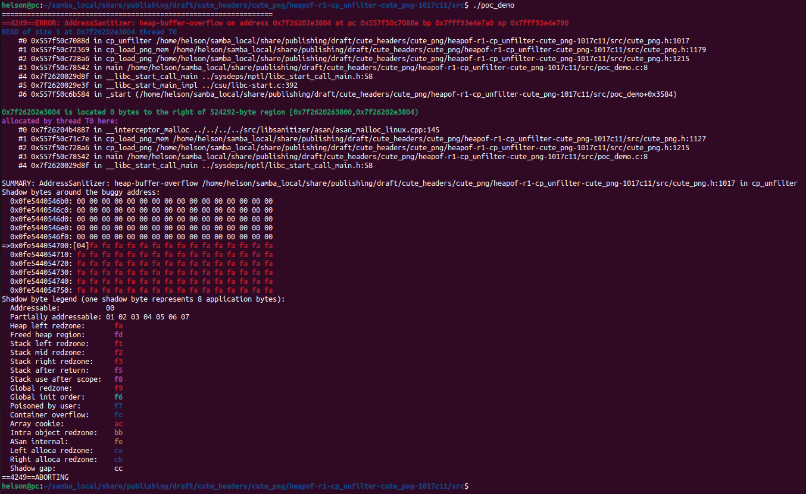

# Description

Heap-buffer-flow bug/vulnerability caused by read access found in function cp_unfilter() at line 1017 of cute_png.h v1.05.

Affected version: cute_png v1.05


# Reproduction

Environment:


Operating system version: Ubuntu 22.04


Linux kernel version: Linux pc 5.19.0-41-generic #42~22.04.1-Ubuntu SMP PREEMPT_DYNAMIC Tue Apr 18 17:40:00 UTC 2 x86_64 x86_64 x86_64 GNU/Linux


Compiler version: gcc version 11.4.0 (Ubuntu 11.4.0-1ubuntu1~22.04)


Run the following command in bash shell:

```shell
#!/bin/bash 
pushd src
make
./poc_demo
```


# Screen-shot




```shell
=================================================================
==4249==ERROR: AddressSanitizer: heap-buffer-overflow on address 0x7f26202e3804 at pc 0x557f50c7088e bp 0x7fff93e4e7a0 sp 0x7fff93e4e790
READ of size 1 at 0x7f26202e3804 thread T0
    #0 0x557f50c7088d in cp_unfilter /home/helson/samba_local/share/publishing/draft/cute_headers/cute_png/heapof-r1-cp_unfilter-cute_png-1017c11/src/cute_png.h:1017
    #1 0x557f50c72369 in cp_load_png_mem /home/helson/samba_local/share/publishing/draft/cute_headers/cute_png/heapof-r1-cp_unfilter-cute_png-1017c11/src/cute_png.h:1179
    #2 0x557f50c728a6 in cp_load_png /home/helson/samba_local/share/publishing/draft/cute_headers/cute_png/heapof-r1-cp_unfilter-cute_png-1017c11/src/cute_png.h:1215
    #3 0x557f50c78542 in main /home/helson/samba_local/share/publishing/draft/cute_headers/cute_png/heapof-r1-cp_unfilter-cute_png-1017c11/src/poc_demo.c:8
    #4 0x7f2620029d8f in __libc_start_call_main ../sysdeps/nptl/libc_start_call_main.h:58
    #5 0x7f2620029e3f in __libc_start_main_impl ../csu/libc-start.c:392
    #6 0x557f50c6b584 in _start (/home/helson/samba_local/share/publishing/draft/cute_headers/cute_png/heapof-r1-cp_unfilter-cute_png-1017c11/src/poc_demo+0x3584)

0x7f26202e3804 is located 0 bytes to the right of 524292-byte region [0x7f2620263800,0x7f26202e3804)
allocated by thread T0 here:
    #0 0x7f26204b4887 in __interceptor_malloc ../../../../src/libsanitizer/asan/asan_malloc_linux.cpp:145
    #1 0x557f50c71c7e in cp_load_png_mem /home/helson/samba_local/share/publishing/draft/cute_headers/cute_png/heapof-r1-cp_unfilter-cute_png-1017c11/src/cute_png.h:1127
    #2 0x557f50c728a6 in cp_load_png /home/helson/samba_local/share/publishing/draft/cute_headers/cute_png/heapof-r1-cp_unfilter-cute_png-1017c11/src/cute_png.h:1215
    #3 0x557f50c78542 in main /home/helson/samba_local/share/publishing/draft/cute_headers/cute_png/heapof-r1-cp_unfilter-cute_png-1017c11/src/poc_demo.c:8
    #4 0x7f2620029d8f in __libc_start_call_main ../sysdeps/nptl/libc_start_call_main.h:58

SUMMARY: AddressSanitizer: heap-buffer-overflow /home/helson/samba_local/share/publishing/draft/cute_headers/cute_png/heapof-r1-cp_unfilter-cute_png-1017c11/src/cute_png.h:1017 in cp_unfilter
Shadow bytes around the buggy address:
  0x0fe5440546b0: 00 00 00 00 00 00 00 00 00 00 00 00 00 00 00 00
  0x0fe5440546c0: 00 00 00 00 00 00 00 00 00 00 00 00 00 00 00 00
  0x0fe5440546d0: 00 00 00 00 00 00 00 00 00 00 00 00 00 00 00 00
  0x0fe5440546e0: 00 00 00 00 00 00 00 00 00 00 00 00 00 00 00 00
  0x0fe5440546f0: 00 00 00 00 00 00 00 00 00 00 00 00 00 00 00 00
=>0x0fe544054700:[04]fa fa fa fa fa fa fa fa fa fa fa fa fa fa fa
  0x0fe544054710: fa fa fa fa fa fa fa fa fa fa fa fa fa fa fa fa
  0x0fe544054720: fa fa fa fa fa fa fa fa fa fa fa fa fa fa fa fa
  0x0fe544054730: fa fa fa fa fa fa fa fa fa fa fa fa fa fa fa fa
  0x0fe544054740: fa fa fa fa fa fa fa fa fa fa fa fa fa fa fa fa
  0x0fe544054750: fa fa fa fa fa fa fa fa fa fa fa fa fa fa fa fa
Shadow byte legend (one shadow byte represents 8 application bytes):
  Addressable:           00
  Partially addressable: 01 02 03 04 05 06 07 
  Heap left redzone:       fa
  Freed heap region:       fd
  Stack left redzone:      f1
  Stack mid redzone:       f2
  Stack right redzone:     f3
  Stack after return:      f5
  Stack use after scope:   f8
  Global redzone:          f9
  Global init order:       f6
  Poisoned by user:        f7
  Container overflow:      fc
  Array cookie:            ac
  Intra object redzone:    bb
  ASan internal:           fe
  Left alloca redzone:     ca
  Right alloca redzone:    cb
  Shadow gap:              cc
==4249==ABORTING

```

