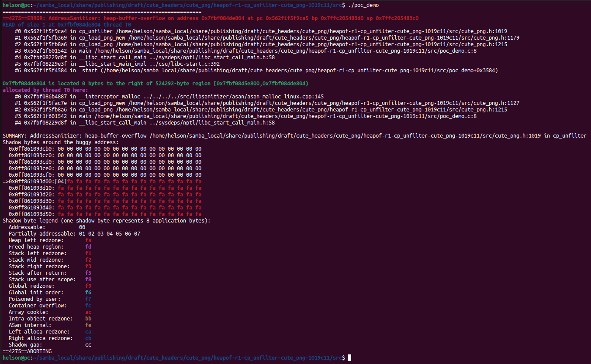

# Description

Heap-buffer-flow bug/vulnerability caused by read access found in function cp_unfilter() at line 1019 of cute_png.h v1.05.

Affected version: cute_png v1.05


# Reproduction

Environment:


Operating system version: Ubuntu 22.04


Linux kernel version: Linux pc 5.19.0-41-generic #42~22.04.1-Ubuntu SMP PREEMPT_DYNAMIC Tue Apr 18 17:40:00 UTC 2 x86_64 x86_64 x86_64 GNU/Linux


Compiler version: gcc version 11.4.0 (Ubuntu 11.4.0-1ubuntu1~22.04)


Run the following command in bash shell:

```shell
#!/bin/bash 
pushd src
make
./poc_demo
```


# Screen-shot




```shell
=================================================================
==4275==ERROR: AddressSanitizer: heap-buffer-overflow on address 0x7fbf084de804 at pc 0x562f1f5f9ca5 bp 0x7ffc205483d0 sp 0x7ffc205483c0
READ of size 1 at 0x7fbf084de804 thread T0
    #0 0x562f1f5f9ca4 in cp_unfilter /home/helson/samba_local/share/publishing/draft/cute_headers/cute_png/heapof-r1-cp_unfilter-cute_png-1019c11/src/cute_png.h:1019
    #1 0x562f1f5fb369 in cp_load_png_mem /home/helson/samba_local/share/publishing/draft/cute_headers/cute_png/heapof-r1-cp_unfilter-cute_png-1019c11/src/cute_png.h:1179
    #2 0x562f1f5fb8a6 in cp_load_png /home/helson/samba_local/share/publishing/draft/cute_headers/cute_png/heapof-r1-cp_unfilter-cute_png-1019c11/src/cute_png.h:1215
    #3 0x562f1f601542 in main /home/helson/samba_local/share/publishing/draft/cute_headers/cute_png/heapof-r1-cp_unfilter-cute_png-1019c11/src/poc_demo.c:8
    #4 0x7fbf08229d8f in __libc_start_call_main ../sysdeps/nptl/libc_start_call_main.h:58
    #5 0x7fbf08229e3f in __libc_start_main_impl ../csu/libc-start.c:392
    #6 0x562f1f5f4584 in _start (/home/helson/samba_local/share/publishing/draft/cute_headers/cute_png/heapof-r1-cp_unfilter-cute_png-1019c11/src/poc_demo+0x3584)

0x7fbf084de804 is located 0 bytes to the right of 524292-byte region [0x7fbf0845e800,0x7fbf084de804)
allocated by thread T0 here:
    #0 0x7fbf086b4887 in __interceptor_malloc ../../../../src/libsanitizer/asan/asan_malloc_linux.cpp:145
    #1 0x562f1f5fac7e in cp_load_png_mem /home/helson/samba_local/share/publishing/draft/cute_headers/cute_png/heapof-r1-cp_unfilter-cute_png-1019c11/src/cute_png.h:1127
    #2 0x562f1f5fb8a6 in cp_load_png /home/helson/samba_local/share/publishing/draft/cute_headers/cute_png/heapof-r1-cp_unfilter-cute_png-1019c11/src/cute_png.h:1215
    #3 0x562f1f601542 in main /home/helson/samba_local/share/publishing/draft/cute_headers/cute_png/heapof-r1-cp_unfilter-cute_png-1019c11/src/poc_demo.c:8
    #4 0x7fbf08229d8f in __libc_start_call_main ../sysdeps/nptl/libc_start_call_main.h:58

SUMMARY: AddressSanitizer: heap-buffer-overflow /home/helson/samba_local/share/publishing/draft/cute_headers/cute_png/heapof-r1-cp_unfilter-cute_png-1019c11/src/cute_png.h:1019 in cp_unfilter
Shadow bytes around the buggy address:
  0x0ff861093cb0: 00 00 00 00 00 00 00 00 00 00 00 00 00 00 00 00
  0x0ff861093cc0: 00 00 00 00 00 00 00 00 00 00 00 00 00 00 00 00
  0x0ff861093cd0: 00 00 00 00 00 00 00 00 00 00 00 00 00 00 00 00
  0x0ff861093ce0: 00 00 00 00 00 00 00 00 00 00 00 00 00 00 00 00
  0x0ff861093cf0: 00 00 00 00 00 00 00 00 00 00 00 00 00 00 00 00
=>0x0ff861093d00:[04]fa fa fa fa fa fa fa fa fa fa fa fa fa fa fa
  0x0ff861093d10: fa fa fa fa fa fa fa fa fa fa fa fa fa fa fa fa
  0x0ff861093d20: fa fa fa fa fa fa fa fa fa fa fa fa fa fa fa fa
  0x0ff861093d30: fa fa fa fa fa fa fa fa fa fa fa fa fa fa fa fa
  0x0ff861093d40: fa fa fa fa fa fa fa fa fa fa fa fa fa fa fa fa
  0x0ff861093d50: fa fa fa fa fa fa fa fa fa fa fa fa fa fa fa fa
Shadow byte legend (one shadow byte represents 8 application bytes):
  Addressable:           00
  Partially addressable: 01 02 03 04 05 06 07 
  Heap left redzone:       fa
  Freed heap region:       fd
  Stack left redzone:      f1
  Stack mid redzone:       f2
  Stack right redzone:     f3
  Stack after return:      f5
  Stack use after scope:   f8
  Global redzone:          f9
  Global init order:       f6
  Poisoned by user:        f7
  Container overflow:      fc
  Array cookie:            ac
  Intra object redzone:    bb
  ASan internal:           fe
  Left alloca redzone:     ca
  Right alloca redzone:    cb
  Shadow gap:              cc
==4275==ABORTING

```

