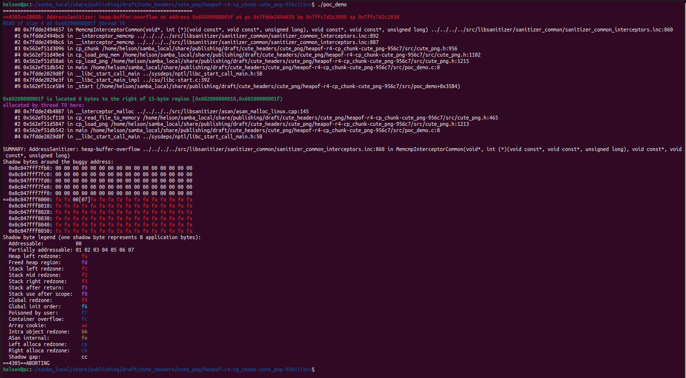

# Description

Heap-buffer-flow bug/vulnerability caused by read access found in function cp_chunk() at line 956 of cute_png.h v1.05.

Affected version: cute_png v1.05


# Reproduction

Environment:


Operating system version: Ubuntu 22.04


Linux kernel version: Linux pc 5.19.0-41-generic #42~22.04.1-Ubuntu SMP PREEMPT_DYNAMIC Tue Apr 18 17:40:00 UTC 2 x86_64 x86_64 x86_64 GNU/Linux


Compiler version: gcc version 11.4.0 (Ubuntu 11.4.0-1ubuntu1~22.04)


Run the following command in bash shell:

```shell
#!/bin/bash 
pushd src
make
./poc_demo
```


# Screen-shot




```shell
=================================================================
==4305==ERROR: AddressSanitizer: heap-buffer-overflow on address 0x60200000001f at pc 0x7fdde2494658 bp 0x7ffc7d2c3090 sp 0x7ffc7d2c2838
READ of size 4 at 0x60200000001f thread T0
    #0 0x7fdde2494657 in MemcmpInterceptorCommon(void*, int (*)(void const*, void const*, unsigned long), void const*, void const*, unsigned long) ../../../../src/libsanitizer/sanitizer_common/sanitizer_common_interceptors.inc:860
    #1 0x7fdde2494bc6 in __interceptor_memcmp ../../../../src/libsanitizer/sanitizer_common/sanitizer_common_interceptors.inc:892
    #2 0x7fdde2494bc6 in __interceptor_memcmp ../../../../src/libsanitizer/sanitizer_common/sanitizer_common_interceptors.inc:887
    #3 0x562ef51d3096 in cp_chunk /home/helson/samba_local/share/publishing/draft/cute_headers/cute_png/heapof-r4-cp_chunk-cute_png-956c7/src/cute_png.h:956
    #4 0x562ef51d49e4 in cp_load_png_mem /home/helson/samba_local/share/publishing/draft/cute_headers/cute_png/heapof-r4-cp_chunk-cute_png-956c7/src/cute_png.h:1102
    #5 0x562ef51d58a6 in cp_load_png /home/helson/samba_local/share/publishing/draft/cute_headers/cute_png/heapof-r4-cp_chunk-cute_png-956c7/src/cute_png.h:1215
    #6 0x562ef51db542 in main /home/helson/samba_local/share/publishing/draft/cute_headers/cute_png/heapof-r4-cp_chunk-cute_png-956c7/src/poc_demo.c:8
    #7 0x7fdde2029d8f in __libc_start_call_main ../sysdeps/nptl/libc_start_call_main.h:58
    #8 0x7fdde2029e3f in __libc_start_main_impl ../csu/libc-start.c:392
    #9 0x562ef51ce584 in _start (/home/helson/samba_local/share/publishing/draft/cute_headers/cute_png/heapof-r4-cp_chunk-cute_png-956c7/src/poc_demo+0x3584)

0x60200000001f is located 0 bytes to the right of 15-byte region [0x602000000010,0x60200000001f)
allocated by thread T0 here:
    #0 0x7fdde24b4887 in __interceptor_malloc ../../../../src/libsanitizer/asan/asan_malloc_linux.cpp:145
    #1 0x562ef51cf110 in cp_read_file_to_memory /home/helson/samba_local/share/publishing/draft/cute_headers/cute_png/heapof-r4-cp_chunk-cute_png-956c7/src/cute_png.h:465
    #2 0x562ef51d5847 in cp_load_png /home/helson/samba_local/share/publishing/draft/cute_headers/cute_png/heapof-r4-cp_chunk-cute_png-956c7/src/cute_png.h:1213
    #3 0x562ef51db542 in main /home/helson/samba_local/share/publishing/draft/cute_headers/cute_png/heapof-r4-cp_chunk-cute_png-956c7/src/poc_demo.c:8
    #4 0x7fdde2029d8f in __libc_start_call_main ../sysdeps/nptl/libc_start_call_main.h:58

SUMMARY: AddressSanitizer: heap-buffer-overflow ../../../../src/libsanitizer/sanitizer_common/sanitizer_common_interceptors.inc:860 in MemcmpInterceptorCommon(void*, int (*)(void const*, void const*, unsigned long), void const*, void const*, unsigned long)
Shadow bytes around the buggy address:
  0x0c047fff7fb0: 00 00 00 00 00 00 00 00 00 00 00 00 00 00 00 00
  0x0c047fff7fc0: 00 00 00 00 00 00 00 00 00 00 00 00 00 00 00 00
  0x0c047fff7fd0: 00 00 00 00 00 00 00 00 00 00 00 00 00 00 00 00
  0x0c047fff7fe0: 00 00 00 00 00 00 00 00 00 00 00 00 00 00 00 00
  0x0c047fff7ff0: 00 00 00 00 00 00 00 00 00 00 00 00 00 00 00 00
=>0x0c047fff8000: fa fa 00[07]fa fa fa fa fa fa fa fa fa fa fa fa
  0x0c047fff8010: fa fa fa fa fa fa fa fa fa fa fa fa fa fa fa fa
  0x0c047fff8020: fa fa fa fa fa fa fa fa fa fa fa fa fa fa fa fa
  0x0c047fff8030: fa fa fa fa fa fa fa fa fa fa fa fa fa fa fa fa
  0x0c047fff8040: fa fa fa fa fa fa fa fa fa fa fa fa fa fa fa fa
  0x0c047fff8050: fa fa fa fa fa fa fa fa fa fa fa fa fa fa fa fa
Shadow byte legend (one shadow byte represents 8 application bytes):
  Addressable:           00
  Partially addressable: 01 02 03 04 05 06 07 
  Heap left redzone:       fa
  Freed heap region:       fd
  Stack left redzone:      f1
  Stack mid redzone:       f2
  Stack right redzone:     f3
  Stack after return:      f5
  Stack use after scope:   f8
  Global redzone:          f9
  Global init order:       f6
  Poisoned by user:        f7
  Container overflow:      fc
  Array cookie:            ac
  Intra object redzone:    bb
  ASan internal:           fe
  Left alloca redzone:     ca
  Right alloca redzone:    cb
  Shadow gap:              cc
==4305==ABORTING

```

