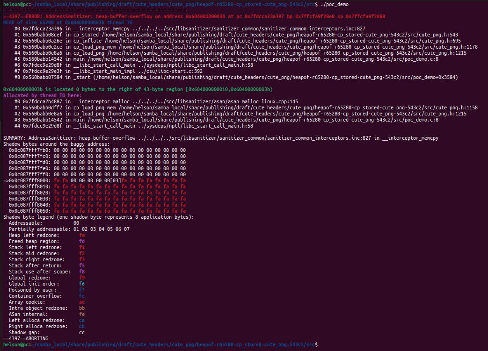

# Description

Heap-buffer-flow bug/vulnerability caused by read access found in function cp_stored() at line 543 of cute_png.h v1.05. What's more, sample10.png provided as attack vector causes double-free heap memory corruption in function cp_load_png_mem() at line 1194 of cute_png.h v1.05.


Affected version: cute_png v1.05


# Reproduction

Environment:


Operating system version: Ubuntu 22.04


Linux kernel version: Linux pc 5.19.0-41-generic #42~22.04.1-Ubuntu SMP PREEMPT_DYNAMIC Tue Apr 18 17:40:00 UTC 2 x86_64 x86_64 x86_64 GNU/Linux


Compiler version: gcc version 11.4.0 (Ubuntu 11.4.0-1ubuntu1~22.04)


Run the following command in bash shell:

```shell
#!/bin/bash 
pushd src
make
./poc_demo
```


# Screen-shot

## heap-buffer-overflow




```shell
=================================================================
==4397==ERROR: AddressSanitizer: heap-buffer-overflow on address 0x60400000003b at pc 0x7fdcca23a397 bp 0x7ffcfa9f28e0 sp 0x7ffcfa9f2088
READ of size 65280 at 0x60400000003b thread T0
    #0 0x7fdcca23a396 in __interceptor_memcpy ../../../../src/libsanitizer/sanitizer_common/sanitizer_common_interceptors.inc:827
    #1 0x560babb08cef in cp_stored /home/helson/samba_local/share/publishing/draft/cute_headers/cute_png/heapof-r65280-cp_stored-cute_png-543c2/src/cute_png.h:543
    #2 0x560babb0a26e in cp_inflate /home/helson/samba_local/share/publishing/draft/cute_headers/cute_png/heapof-r65280-cp_stored-cute_png-543c2/src/cute_png.h:695
    #3 0x560babb0e2ce in cp_load_png_mem /home/helson/samba_local/share/publishing/draft/cute_headers/cute_png/heapof-r65280-cp_stored-cute_png-543c2/src/cute_png.h:1178
    #4 0x560babb0e8a6 in cp_load_png /home/helson/samba_local/share/publishing/draft/cute_headers/cute_png/heapof-r65280-cp_stored-cute_png-543c2/src/cute_png.h:1215
    #5 0x560babb14542 in main /home/helson/samba_local/share/publishing/draft/cute_headers/cute_png/heapof-r65280-cp_stored-cute_png-543c2/src/poc_demo.c:8
    #6 0x7fdcc9e29d8f in __libc_start_call_main ../sysdeps/nptl/libc_start_call_main.h:58
    #7 0x7fdcc9e29e3f in __libc_start_main_impl ../csu/libc-start.c:392
    #8 0x560babb07584 in _start (/home/helson/samba_local/share/publishing/draft/cute_headers/cute_png/heapof-r65280-cp_stored-cute_png-543c2/src/poc_demo+0x3584)

0x60400000003b is located 0 bytes to the right of 43-byte region [0x604000000010,0x60400000003b)
allocated by thread T0 here:
    #0 0x7fdcca2b4887 in __interceptor_malloc ../../../../src/libsanitizer/asan/asan_malloc_linux.cpp:145
    #1 0x560babb0dff2 in cp_load_png_mem /home/helson/samba_local/share/publishing/draft/cute_headers/cute_png/heapof-r65280-cp_stored-cute_png-543c2/src/cute_png.h:1158
    #2 0x560babb0e8a6 in cp_load_png /home/helson/samba_local/share/publishing/draft/cute_headers/cute_png/heapof-r65280-cp_stored-cute_png-543c2/src/cute_png.h:1215
    #3 0x560babb14542 in main /home/helson/samba_local/share/publishing/draft/cute_headers/cute_png/heapof-r65280-cp_stored-cute_png-543c2/src/poc_demo.c:8
    #4 0x7fdcc9e29d8f in __libc_start_call_main ../sysdeps/nptl/libc_start_call_main.h:58

SUMMARY: AddressSanitizer: heap-buffer-overflow ../../../../src/libsanitizer/sanitizer_common/sanitizer_common_interceptors.inc:827 in __interceptor_memcpy
Shadow bytes around the buggy address:
  0x0c087fff7fb0: 00 00 00 00 00 00 00 00 00 00 00 00 00 00 00 00
  0x0c087fff7fc0: 00 00 00 00 00 00 00 00 00 00 00 00 00 00 00 00
  0x0c087fff7fd0: 00 00 00 00 00 00 00 00 00 00 00 00 00 00 00 00
  0x0c087fff7fe0: 00 00 00 00 00 00 00 00 00 00 00 00 00 00 00 00
  0x0c087fff7ff0: 00 00 00 00 00 00 00 00 00 00 00 00 00 00 00 00
=>0x0c087fff8000: fa fa 00 00 00 00 00[03]fa fa fa fa fa fa fa fa
  0x0c087fff8010: fa fa fa fa fa fa fa fa fa fa fa fa fa fa fa fa
  0x0c087fff8020: fa fa fa fa fa fa fa fa fa fa fa fa fa fa fa fa
  0x0c087fff8030: fa fa fa fa fa fa fa fa fa fa fa fa fa fa fa fa
  0x0c087fff8040: fa fa fa fa fa fa fa fa fa fa fa fa fa fa fa fa
  0x0c087fff8050: fa fa fa fa fa fa fa fa fa fa fa fa fa fa fa fa
Shadow byte legend (one shadow byte represents 8 application bytes):
  Addressable:           00
  Partially addressable: 01 02 03 04 05 06 07 
  Heap left redzone:       fa
  Freed heap region:       fd
  Stack left redzone:      f1
  Stack mid redzone:       f2
  Stack right redzone:     f3
  Stack after return:      f5
  Stack use after scope:   f8
  Global redzone:          f9
  Global init order:       f6
  Poisoned by user:        f7
  Container overflow:      fc
  Array cookie:            ac
  Intra object redzone:    bb
  ASan internal:           fe
  Left alloca redzone:     ca
  Right alloca redzone:    cb
  Shadow gap:              cc
==4397==ABORTING

```


## double-free heap memory corruption


