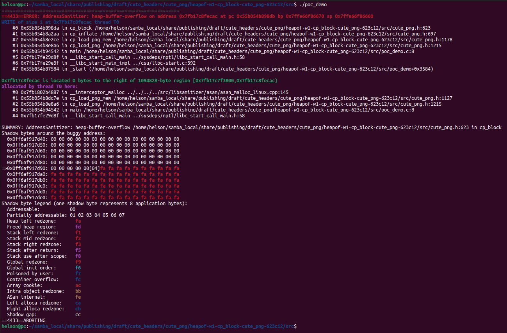
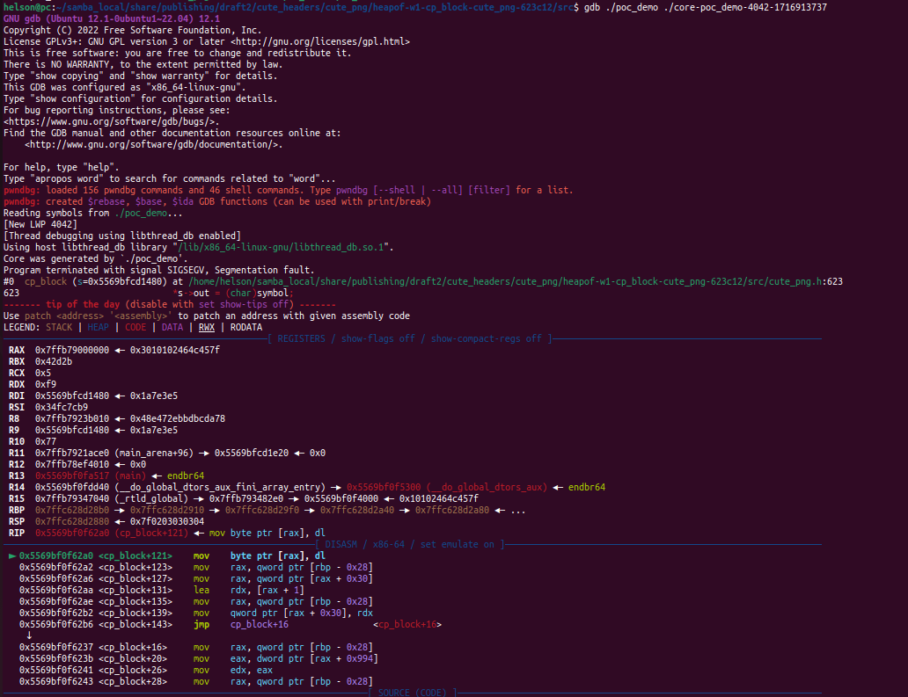
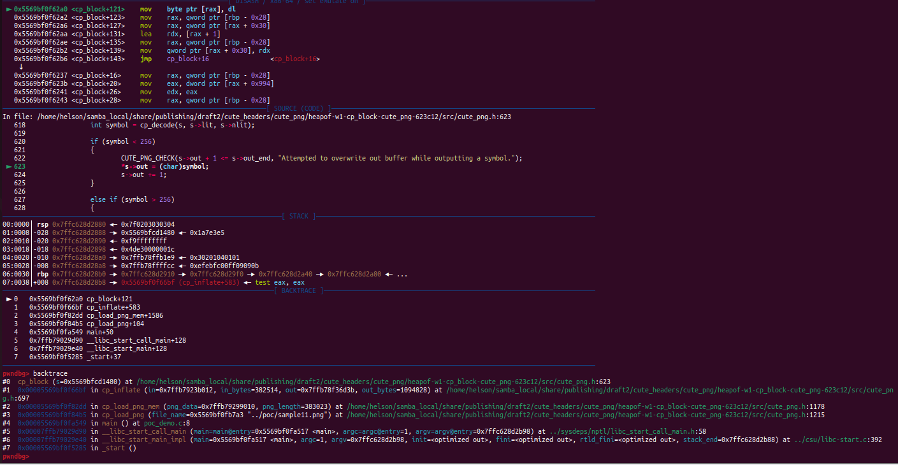
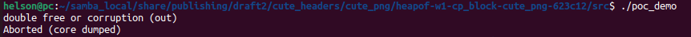
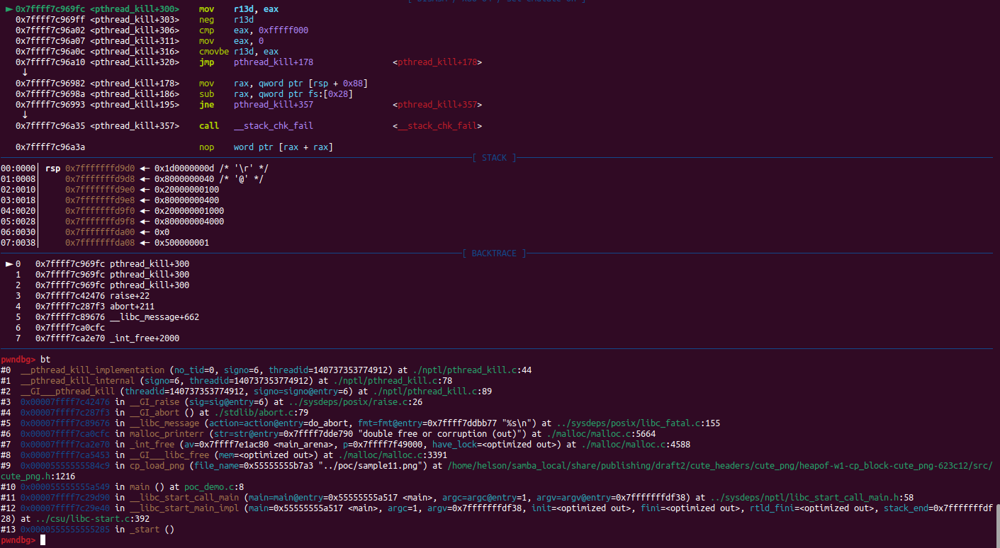

# Description

Heap-buffer-flow and segmentation fault bug/vulnerability caused by write access found in function cp_block() at line 623 of cute_png.h v1.05. What's more, sample11.png provided as attack vector causes double-free heap memory corruption in function cp_load_png() at line 1216 of cute_png.h v1.05.


Affected version: cute_png v1.05


# Reproduction

Environment:


Operating system version: Ubuntu 22.04


Linux kernel version: Linux pc 5.19.0-41-generic #42~22.04.1-Ubuntu SMP PREEMPT_DYNAMIC Tue Apr 18 17:40:00 UTC 2 x86_64 x86_64 x86_64 GNU/Linux


Compiler version: gcc version 11.4.0 (Ubuntu 11.4.0-1ubuntu1~22.04)


Run the following command in bash shell:

```shell
#!/bin/bash 
pushd src
make
./poc_demo
```


Coredump file for segmentation fault bug/vulnerabilty is provided in heapof-w1-cp_block-cute_png-623c12/coredump directory.


# Screen-shot

## heap-buffer-overflow




```shell
=================================================================
==4433==ERROR: AddressSanitizer: heap-buffer-overflow on address 0x7fb17c8fecac at pc 0x55b054b898db bp 0x7ffe66f86670 sp 0x7ffe66f86660
WRITE of size 1 at 0x7fb17c8fecac thread T0
    #0 0x55b054b898da in cp_block /home/helson/samba_local/share/publishing/draft/cute_headers/cute_png/heapof-w1-cp_block-cute_png-623c12/src/cute_png.h:623
    #1 0x55b054b8a2aa in cp_inflate /home/helson/samba_local/share/publishing/draft/cute_headers/cute_png/heapof-w1-cp_block-cute_png-623c12/src/cute_png.h:697
    #2 0x55b054b8e2ce in cp_load_png_mem /home/helson/samba_local/share/publishing/draft/cute_headers/cute_png/heapof-w1-cp_block-cute_png-623c12/src/cute_png.h:1178
    #3 0x55b054b8e8a6 in cp_load_png /home/helson/samba_local/share/publishing/draft/cute_headers/cute_png/heapof-w1-cp_block-cute_png-623c12/src/cute_png.h:1215
    #4 0x55b054b94542 in main /home/helson/samba_local/share/publishing/draft/cute_headers/cute_png/heapof-w1-cp_block-cute_png-623c12/src/poc_demo.c:8
    #5 0x7fb17fe29d8f in __libc_start_call_main ../sysdeps/nptl/libc_start_call_main.h:58
    #6 0x7fb17fe29e3f in __libc_start_main_impl ../csu/libc-start.c:392
    #7 0x55b054b87584 in _start (/home/helson/samba_local/share/publishing/draft/cute_headers/cute_png/heapof-w1-cp_block-cute_png-623c12/src/poc_demo+0x3584)

0x7fb17c8fecac is located 0 bytes to the right of 1094828-byte region [0x7fb17c7f3800,0x7fb17c8fecac)
allocated by thread T0 here:
    #0 0x7fb1802b4887 in __interceptor_malloc ../../../../src/libsanitizer/asan/asan_malloc_linux.cpp:145
    #1 0x55b054b8dc7e in cp_load_png_mem /home/helson/samba_local/share/publishing/draft/cute_headers/cute_png/heapof-w1-cp_block-cute_png-623c12/src/cute_png.h:1127
    #2 0x55b054b8e8a6 in cp_load_png /home/helson/samba_local/share/publishing/draft/cute_headers/cute_png/heapof-w1-cp_block-cute_png-623c12/src/cute_png.h:1215
    #3 0x55b054b94542 in main /home/helson/samba_local/share/publishing/draft/cute_headers/cute_png/heapof-w1-cp_block-cute_png-623c12/src/poc_demo.c:8
    #4 0x7fb17fe29d8f in __libc_start_call_main ../sysdeps/nptl/libc_start_call_main.h:58

SUMMARY: AddressSanitizer: heap-buffer-overflow /home/helson/samba_local/share/publishing/draft/cute_headers/cute_png/heapof-w1-cp_block-cute_png-623c12/src/cute_png.h:623 in cp_block
Shadow bytes around the buggy address:
  0x0ff6af917d40: 00 00 00 00 00 00 00 00 00 00 00 00 00 00 00 00
  0x0ff6af917d50: 00 00 00 00 00 00 00 00 00 00 00 00 00 00 00 00
  0x0ff6af917d60: 00 00 00 00 00 00 00 00 00 00 00 00 00 00 00 00
  0x0ff6af917d70: 00 00 00 00 00 00 00 00 00 00 00 00 00 00 00 00
  0x0ff6af917d80: 00 00 00 00 00 00 00 00 00 00 00 00 00 00 00 00
=>0x0ff6af917d90: 00 00 00 00 00[04]fa fa fa fa fa fa fa fa fa fa
  0x0ff6af917da0: fa fa fa fa fa fa fa fa fa fa fa fa fa fa fa fa
  0x0ff6af917db0: fa fa fa fa fa fa fa fa fa fa fa fa fa fa fa fa
  0x0ff6af917dc0: fa fa fa fa fa fa fa fa fa fa fa fa fa fa fa fa
  0x0ff6af917dd0: fa fa fa fa fa fa fa fa fa fa fa fa fa fa fa fa
  0x0ff6af917de0: fa fa fa fa fa fa fa fa fa fa fa fa fa fa fa fa
Shadow byte legend (one shadow byte represents 8 application bytes):
  Addressable:           00
  Partially addressable: 01 02 03 04 05 06 07 
  Heap left redzone:       fa
  Freed heap region:       fd
  Stack left redzone:      f1
  Stack mid redzone:       f2
  Stack right redzone:     f3
  Stack after return:      f5
  Stack use after scope:   f8
  Global redzone:          f9
  Global init order:       f6
  Poisoned by user:        f7
  Container overflow:      fc
  Array cookie:            ac
  Intra object redzone:    bb
  ASan internal:           fe
  Left alloca redzone:     ca
  Right alloca redzone:    cb
  Shadow gap:              cc
==4433==ABORTING

```


## segmentation fault







## double-free heap memory corruption





