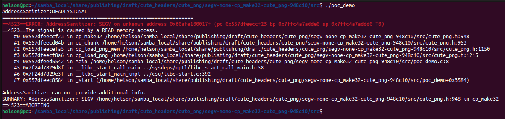

# Description

Segmentation Fault bug/vulnerability caused by read access found in function cp_make32() at line 948 of cute_png.h v1.05. Function cp_make32() is called by cp_chunk().


Affected version: cute_png v1.05


# Reproduction

Environment:


Operating system version: Ubuntu 22.04


Linux kernel version: Linux pc 5.19.0-41-generic #42~22.04.1-Ubuntu SMP PREEMPT_DYNAMIC Tue Apr 18 17:40:00 UTC 2 x86_64 x86_64 x86_64 GNU/Linux


Compiler version: gcc version 11.4.0 (Ubuntu 11.4.0-1ubuntu1~22.04)


Run the following command in bash shell:

```shell
#!/bin/bash 
pushd src
make
./poc_demo
```


# Screen-shot




```shell
AddressSanitizer:DEADLYSIGNAL
=================================================================
==4523==ERROR: AddressSanitizer: SEGV on unknown address 0x60afe100017f (pc 0x557dfeeccf23 bp 0x7ffc4a7adde0 sp 0x7ffc4a7addd0 T0)
==4523==The signal is caused by a READ memory access.
    #0 0x557dfeeccf23 in cp_make32 /home/helson/samba_local/share/publishing/draft/cute_headers/cute_png/segv-none-cp_make32-cute_png-948c10/src/cute_png.h:948
    #1 0x557dfeecd04b in cp_chunk /home/helson/samba_local/share/publishing/draft/cute_headers/cute_png/segv-none-cp_make32-cute_png-948c10/src/cute_png.h:953
    #2 0x557dfeecefa5 in cp_load_png_mem /home/helson/samba_local/share/publishing/draft/cute_headers/cute_png/segv-none-cp_make32-cute_png-948c10/src/cute_png.h:1150
    #3 0x557dfeecf8a6 in cp_load_png /home/helson/samba_local/share/publishing/draft/cute_headers/cute_png/segv-none-cp_make32-cute_png-948c10/src/cute_png.h:1215
    #4 0x557dfeed5542 in main /home/helson/samba_local/share/publishing/draft/cute_headers/cute_png/segv-none-cp_make32-cute_png-948c10/src/poc_demo.c:8
    #5 0x7f24d7829d8f in __libc_start_call_main ../sysdeps/nptl/libc_start_call_main.h:58
    #6 0x7f24d7829e3f in __libc_start_main_impl ../csu/libc-start.c:392
    #7 0x557dfeec8584 in _start (/home/helson/samba_local/share/publishing/draft/cute_headers/cute_png/segv-none-cp_make32-cute_png-948c10/src/poc_demo+0x3584)

AddressSanitizer can not provide additional info.
SUMMARY: AddressSanitizer: SEGV /home/helson/samba_local/share/publishing/draft/cute_headers/cute_png/segv-none-cp_make32-cute_png-948c10/src/cute_png.h:948 in cp_make32
==4523==ABORTING

```

