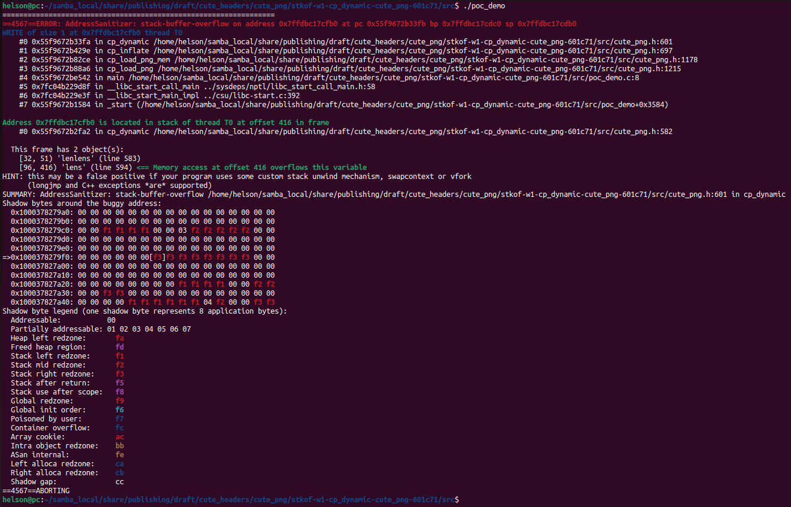

# Description

stack-buffer-overflow bug/vulnerability caused by write access found in function cp_dynamic() at line 601 of cute_png.h v1.05.


Affected version: cute_png v1.05


# Reproduction

Environment:


Operating system version: Ubuntu 22.04


Linux kernel version: Linux pc 5.19.0-41-generic #42~22.04.1-Ubuntu SMP PREEMPT_DYNAMIC Tue Apr 18 17:40:00 UTC 2 x86_64 x86_64 x86_64 GNU/Linux


Compiler version: gcc version 11.4.0 (Ubuntu 11.4.0-1ubuntu1~22.04)


Run the following command in bash shell:

```shell
#!/bin/bash 
pushd src
make
./poc_demo
```


# Screen-shot




```shell
=================================================================
==4567==ERROR: AddressSanitizer: stack-buffer-overflow on address 0x7ffdbc17cfb0 at pc 0x55f9672b33fb bp 0x7ffdbc17cdc0 sp 0x7ffdbc17cdb0
WRITE of size 1 at 0x7ffdbc17cfb0 thread T0
    #0 0x55f9672b33fa in cp_dynamic /home/helson/samba_local/share/publishing/draft/cute_headers/cute_png/stkof-w1-cp_dynamic-cute_png-601c71/src/cute_png.h:601
    #1 0x55f9672b429e in cp_inflate /home/helson/samba_local/share/publishing/draft/cute_headers/cute_png/stkof-w1-cp_dynamic-cute_png-601c71/src/cute_png.h:697
    #2 0x55f9672b82ce in cp_load_png_mem /home/helson/samba_local/share/publishing/draft/cute_headers/cute_png/stkof-w1-cp_dynamic-cute_png-601c71/src/cute_png.h:1178
    #3 0x55f9672b88a6 in cp_load_png /home/helson/samba_local/share/publishing/draft/cute_headers/cute_png/stkof-w1-cp_dynamic-cute_png-601c71/src/cute_png.h:1215
    #4 0x55f9672be542 in main /home/helson/samba_local/share/publishing/draft/cute_headers/cute_png/stkof-w1-cp_dynamic-cute_png-601c71/src/poc_demo.c:8
    #5 0x7fc04b229d8f in __libc_start_call_main ../sysdeps/nptl/libc_start_call_main.h:58
    #6 0x7fc04b229e3f in __libc_start_main_impl ../csu/libc-start.c:392
    #7 0x55f9672b1584 in _start (/home/helson/samba_local/share/publishing/draft/cute_headers/cute_png/stkof-w1-cp_dynamic-cute_png-601c71/src/poc_demo+0x3584)

Address 0x7ffdbc17cfb0 is located in stack of thread T0 at offset 416 in frame
    #0 0x55f9672b2fa2 in cp_dynamic /home/helson/samba_local/share/publishing/draft/cute_headers/cute_png/stkof-w1-cp_dynamic-cute_png-601c71/src/cute_png.h:582

  This frame has 2 object(s):
    [32, 51) 'lenlens' (line 583)
    [96, 416) 'lens' (line 594) <== Memory access at offset 416 overflows this variable
HINT: this may be a false positive if your program uses some custom stack unwind mechanism, swapcontext or vfork
      (longjmp and C++ exceptions *are* supported)
SUMMARY: AddressSanitizer: stack-buffer-overflow /home/helson/samba_local/share/publishing/draft/cute_headers/cute_png/stkof-w1-cp_dynamic-cute_png-601c71/src/cute_png.h:601 in cp_dynamic
Shadow bytes around the buggy address:
  0x1000378279a0: 00 00 00 00 00 00 00 00 00 00 00 00 00 00 00 00
  0x1000378279b0: 00 00 00 00 00 00 00 00 00 00 00 00 00 00 00 00
  0x1000378279c0: 00 00 f1 f1 f1 f1 00 00 03 f2 f2 f2 f2 f2 00 00
  0x1000378279d0: 00 00 00 00 00 00 00 00 00 00 00 00 00 00 00 00
  0x1000378279e0: 00 00 00 00 00 00 00 00 00 00 00 00 00 00 00 00
=>0x1000378279f0: 00 00 00 00 00 00[f3]f3 f3 f3 f3 f3 f3 f3 00 00
  0x100037827a00: 00 00 00 00 00 00 00 00 00 00 00 00 00 00 00 00
  0x100037827a10: 00 00 00 00 00 00 00 00 00 00 00 00 00 00 00 00
  0x100037827a20: 00 00 00 00 00 00 00 00 f1 f1 f1 f1 00 00 f2 f2
  0x100037827a30: 00 00 f3 f3 00 00 00 00 00 00 00 00 00 00 00 00
  0x100037827a40: 00 00 00 00 f1 f1 f1 f1 f1 f1 04 f2 00 00 f3 f3
Shadow byte legend (one shadow byte represents 8 application bytes):
  Addressable:           00
  Partially addressable: 01 02 03 04 05 06 07 
  Heap left redzone:       fa
  Freed heap region:       fd
  Stack left redzone:      f1
  Stack mid redzone:       f2
  Stack right redzone:     f3
  Stack after return:      f5
  Stack use after scope:   f8
  Global redzone:          f9
  Global init order:       f6
  Poisoned by user:        f7
  Container overflow:      fc
  Array cookie:            ac
  Intra object redzone:    bb
  ASan internal:           fe
  Left alloca redzone:     ca
  Right alloca redzone:    cb
  Shadow gap:              cc
==4567==ABORTING

```

