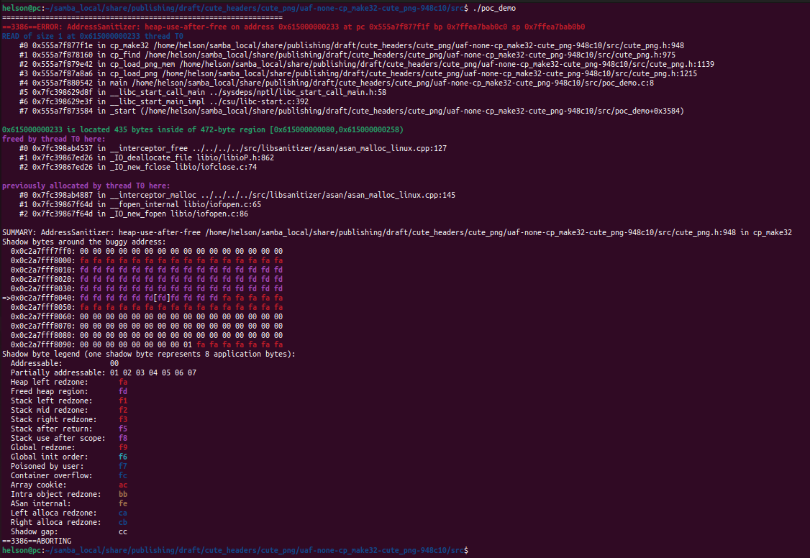

# Description

heap-use-after-free bug/vulnerability caused by read access found in function cp_make32() at line 948 of cute_png.h v1.05.


Affected version: cute_png v1.05


# Reproduction

Environment:


Operating system version: Ubuntu 22.04


Linux kernel version: Linux pc 5.19.0-41-generic #42~22.04.1-Ubuntu SMP PREEMPT_DYNAMIC Tue Apr 18 17:40:00 UTC 2 x86_64 x86_64 x86_64 GNU/Linux


Compiler version: gcc version 11.4.0 (Ubuntu 11.4.0-1ubuntu1~22.04)


Run the following command in bash shell:

```shell
#!/bin/bash 
pushd src
make
./poc_demo
```


# Screen-shot




```shell
=================================================================
==3386==ERROR: AddressSanitizer: heap-use-after-free on address 0x615000000233 at pc 0x555a7f877f1f bp 0x7ffea7bab0c0 sp 0x7ffea7bab0b0
READ of size 1 at 0x615000000233 thread T0
    #0 0x555a7f877f1e in cp_make32 /home/helson/samba_local/share/publishing/draft/cute_headers/cute_png/uaf-none-cp_make32-cute_png-948c10/src/cute_png.h:948
    #1 0x555a7f878160 in cp_find /home/helson/samba_local/share/publishing/draft/cute_headers/cute_png/uaf-none-cp_make32-cute_png-948c10/src/cute_png.h:975
    #2 0x555a7f879e42 in cp_load_png_mem /home/helson/samba_local/share/publishing/draft/cute_headers/cute_png/uaf-none-cp_make32-cute_png-948c10/src/cute_png.h:1139
    #3 0x555a7f87a8a6 in cp_load_png /home/helson/samba_local/share/publishing/draft/cute_headers/cute_png/uaf-none-cp_make32-cute_png-948c10/src/cute_png.h:1215
    #4 0x555a7f880542 in main /home/helson/samba_local/share/publishing/draft/cute_headers/cute_png/uaf-none-cp_make32-cute_png-948c10/src/poc_demo.c:8
    #5 0x7fc398629d8f in __libc_start_call_main ../sysdeps/nptl/libc_start_call_main.h:58
    #6 0x7fc398629e3f in __libc_start_main_impl ../csu/libc-start.c:392
    #7 0x555a7f873584 in _start (/home/helson/samba_local/share/publishing/draft/cute_headers/cute_png/uaf-none-cp_make32-cute_png-948c10/src/poc_demo+0x3584)

0x615000000233 is located 435 bytes inside of 472-byte region [0x615000000080,0x615000000258)
freed by thread T0 here:
    #0 0x7fc398ab4537 in __interceptor_free ../../../../src/libsanitizer/asan/asan_malloc_linux.cpp:127
    #1 0x7fc39867ed26 in _IO_deallocate_file libio/libioP.h:862
    #2 0x7fc39867ed26 in _IO_new_fclose libio/iofclose.c:74

previously allocated by thread T0 here:
    #0 0x7fc398ab4887 in __interceptor_malloc ../../../../src/libsanitizer/asan/asan_malloc_linux.cpp:145
    #1 0x7fc39867f64d in __fopen_internal libio/iofopen.c:65
    #2 0x7fc39867f64d in _IO_new_fopen libio/iofopen.c:86

SUMMARY: AddressSanitizer: heap-use-after-free /home/helson/samba_local/share/publishing/draft/cute_headers/cute_png/uaf-none-cp_make32-cute_png-948c10/src/cute_png.h:948 in cp_make32
Shadow bytes around the buggy address:
  0x0c2a7fff7ff0: 00 00 00 00 00 00 00 00 00 00 00 00 00 00 00 00
  0x0c2a7fff8000: fa fa fa fa fa fa fa fa fa fa fa fa fa fa fa fa
  0x0c2a7fff8010: fd fd fd fd fd fd fd fd fd fd fd fd fd fd fd fd
  0x0c2a7fff8020: fd fd fd fd fd fd fd fd fd fd fd fd fd fd fd fd
  0x0c2a7fff8030: fd fd fd fd fd fd fd fd fd fd fd fd fd fd fd fd
=>0x0c2a7fff8040: fd fd fd fd fd fd[fd]fd fd fd fd fa fa fa fa fa
  0x0c2a7fff8050: fa fa fa fa fa fa fa fa fa fa fa fa fa fa fa fa
  0x0c2a7fff8060: 00 00 00 00 00 00 00 00 00 00 00 00 00 00 00 00
  0x0c2a7fff8070: 00 00 00 00 00 00 00 00 00 00 00 00 00 00 00 00
  0x0c2a7fff8080: 00 00 00 00 00 00 00 00 00 00 00 00 00 00 00 00
  0x0c2a7fff8090: 00 00 00 00 00 00 00 00 01 fa fa fa fa fa fa fa
Shadow byte legend (one shadow byte represents 8 application bytes):
  Addressable:           00
  Partially addressable: 01 02 03 04 05 06 07 
  Heap left redzone:       fa
  Freed heap region:       fd
  Stack left redzone:      f1
  Stack mid redzone:       f2
  Stack right redzone:     f3
  Stack after return:      f5
  Stack use after scope:   f8
  Global redzone:          f9
  Global init order:       f6
  Poisoned by user:        f7
  Container overflow:      fc
  Array cookie:            ac
  Intra object redzone:    bb
  ASan internal:           fe
  Left alloca redzone:     ca
  Right alloca redzone:    cb
  Shadow gap:              cc
==3386==ABORTING

```

