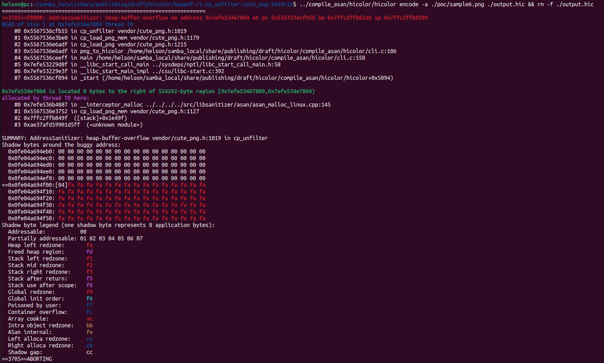

# Description

Heap-buffer-flow bug/vulnerability caused by read access found in function cp_unfilter() at line 1019 of vendor/cute_png.h v1.05.


Affected version: hicolor v0.5.0


# Reproduction

Environment:


Operating system version: Ubuntu 22.04


Linux kernel version: Linux pc 5.19.0-41-generic #42~22.04.1-Ubuntu SMP PREEMPT_DYNAMIC Tue Apr 18 17:40:00 UTC 2 x86_64 x86_64 x86_64 GNU/Linux


Compiler version: gcc version 11.4.0 (Ubuntu 11.4.0-1ubuntu1~22.04)


Compile hicolor with ASAN and run the following command in bash shell:

```shell
hicolor encode -a ./poc/sample6.png ./output.hic && rm -f ./output.hic
```


# Screen-shot




```shell
=================================================================
==3705==ERROR: AddressSanitizer: heap-buffer-overflow on address 0x7efe534e7804 at pc 0x5567536cfb56 bp 0x7ffc2ffb82a0 sp 0x7ffc2ffb8290
READ of size 1 at 0x7efe534e7804 thread T0
    #0 0x5567536cfb55 in cp_unfilter vendor/cute_png.h:1019
    #1 0x5567536e3be0 in cp_load_png_mem vendor/cute_png.h:1179
    #2 0x5567536e6adf in cp_load_png vendor/cute_png.h:1215
    #3 0x5567536e6adf in png_to_hicolor /home/helson/samba_local/share/publishing/draft/hicolor/compile_asan/hicolor/cli.c:106
    #4 0x5567536ceeff in main /home/helson/samba_local/share/publishing/draft/hicolor/compile_asan/hicolor/cli.c:558
    #5 0x7efe53229d8f in __libc_start_call_main ../sysdeps/nptl/libc_start_call_main.h:58
    #6 0x7efe53229e3f in __libc_start_main_impl ../csu/libc-start.c:392
    #7 0x5567536cf094 in _start (/home/helson/samba_local/share/publishing/draft/hicolor/compile_asan/hicolor/hicolor+0x5094)

0x7efe534e7804 is located 0 bytes to the right of 524292-byte region [0x7efe53467800,0x7efe534e7804)
allocated by thread T0 here:
    #0 0x7efe536b4887 in __interceptor_malloc ../../../../src/libsanitizer/asan/asan_malloc_linux.cpp:145
    #1 0x5567536e3752 in cp_load_png_mem vendor/cute_png.h:1127
    #2 0x7ffc2ffb849f  ([stack]+0x1e49f)
    #3 0xae37afd59901d5ff  (<unknown module>)

SUMMARY: AddressSanitizer: heap-buffer-overflow vendor/cute_png.h:1019 in cp_unfilter
Shadow bytes around the buggy address:
  0x0fe04a694eb0: 00 00 00 00 00 00 00 00 00 00 00 00 00 00 00 00
  0x0fe04a694ec0: 00 00 00 00 00 00 00 00 00 00 00 00 00 00 00 00
  0x0fe04a694ed0: 00 00 00 00 00 00 00 00 00 00 00 00 00 00 00 00
  0x0fe04a694ee0: 00 00 00 00 00 00 00 00 00 00 00 00 00 00 00 00
  0x0fe04a694ef0: 00 00 00 00 00 00 00 00 00 00 00 00 00 00 00 00
=>0x0fe04a694f00:[04]fa fa fa fa fa fa fa fa fa fa fa fa fa fa fa
  0x0fe04a694f10: fa fa fa fa fa fa fa fa fa fa fa fa fa fa fa fa
  0x0fe04a694f20: fa fa fa fa fa fa fa fa fa fa fa fa fa fa fa fa
  0x0fe04a694f30: fa fa fa fa fa fa fa fa fa fa fa fa fa fa fa fa
  0x0fe04a694f40: fa fa fa fa fa fa fa fa fa fa fa fa fa fa fa fa
  0x0fe04a694f50: fa fa fa fa fa fa fa fa fa fa fa fa fa fa fa fa
Shadow byte legend (one shadow byte represents 8 application bytes):
  Addressable:           00
  Partially addressable: 01 02 03 04 05 06 07 
  Heap left redzone:       fa
  Freed heap region:       fd
  Stack left redzone:      f1
  Stack mid redzone:       f2
  Stack right redzone:     f3
  Stack after return:      f5
  Stack use after scope:   f8
  Global redzone:          f9
  Global init order:       f6
  Poisoned by user:        f7
  Container overflow:      fc
  Array cookie:            ac
  Intra object redzone:    bb
  ASan internal:           fe
  Left alloca redzone:     ca
  Right alloca redzone:    cb
  Shadow gap:              cc
==3705==ABORTING

```

