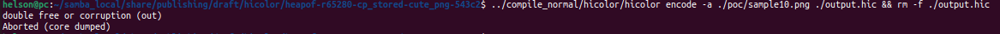
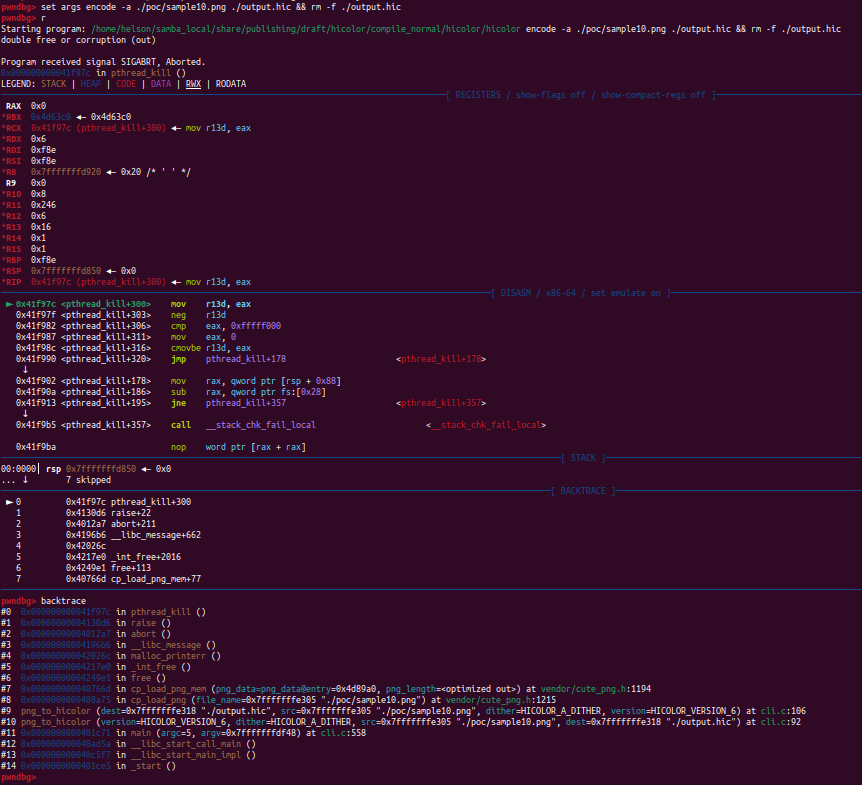

# Description

Heap-buffer-flow bug/vulnerability caused by read access found in function cp_stored() at line 543 of vendor/cute_png.h v1.05. What's more, sample10.png provided as attack vector causes double-free heap memory corruption in function cp_load_png_mem() at line 1194 of vendor/cute_png.h v1.05.


Affected version: hicolor v0.5.0


# Reproduction

Environment:


Operating system version: Ubuntu 22.04


Linux kernel version: Linux pc 5.19.0-41-generic #42~22.04.1-Ubuntu SMP PREEMPT_DYNAMIC Tue Apr 18 17:40:00 UTC 2 x86_64 x86_64 x86_64 GNU/Linux


Compiler version: gcc version 11.4.0 (Ubuntu 11.4.0-1ubuntu1~22.04)


Compile hicolor with ASAN and run the following command in bash shell:

```shell
hicolor encode -a ./poc/sample10.png ./output.hic && rm -f ./output.hic
```


# Screen-shot

## heap-buffer-overflow


```shell
=================================================================
==3766==ERROR: AddressSanitizer: heap-buffer-overflow on address 0x60400000003b at pc 0x7f32cac3a397 bp 0x7fffe96c4fe0 sp 0x7fffe96c4788
READ of size 65280 at 0x60400000003b thread T0
    #0 0x7f32cac3a396 in __interceptor_memcpy ../../../../src/libsanitizer/sanitizer_common/sanitizer_common_interceptors.inc:827
    #1 0x5648c3ba0770 in memcpy /usr/include/x86_64-linux-gnu/bits/string_fortified.h:29
    #2 0x5648c3ba0770 in cp_stored vendor/cute_png.h:543
    #3 0x5648c3ba0770 in cp_inflate vendor/cute_png.h:695
    #4 0x5648c3ba7b69 in cp_load_png_mem vendor/cute_png.h:1178
    #5 0x5648c3baaadf in cp_load_png vendor/cute_png.h:1215
    #6 0x5648c3baaadf in png_to_hicolor /home/helson/samba_local/share/publishing/draft/hicolor/compile_asan/hicolor/cli.c:106
    #7 0x5648c3b92eff in main /home/helson/samba_local/share/publishing/draft/hicolor/compile_asan/hicolor/cli.c:558
    #8 0x7f32ca829d8f in __libc_start_call_main ../sysdeps/nptl/libc_start_call_main.h:58
    #9 0x7f32ca829e3f in __libc_start_main_impl ../csu/libc-start.c:392
    #10 0x5648c3b93094 in _start (/home/helson/samba_local/share/publishing/draft/hicolor/compile_asan/hicolor/hicolor+0x5094)

0x60400000003b is located 0 bytes to the right of 43-byte region [0x604000000010,0x60400000003b)
allocated by thread T0 here:
    #0 0x7f32cacb4887 in __interceptor_malloc ../../../../src/libsanitizer/asan/asan_malloc_linux.cpp:145
    #1 0x5648c3ba7a12 in cp_load_png_mem vendor/cute_png.h:1158
    #2 0x7fffe96c548f  ([stack]+0x1f48f)
    #3 0x8000000000000005  (<unknown module>)

SUMMARY: AddressSanitizer: heap-buffer-overflow ../../../../src/libsanitizer/sanitizer_common/sanitizer_common_interceptors.inc:827 in __interceptor_memcpy
Shadow bytes around the buggy address:
  0x0c087fff7fb0: 00 00 00 00 00 00 00 00 00 00 00 00 00 00 00 00
  0x0c087fff7fc0: 00 00 00 00 00 00 00 00 00 00 00 00 00 00 00 00
  0x0c087fff7fd0: 00 00 00 00 00 00 00 00 00 00 00 00 00 00 00 00
  0x0c087fff7fe0: 00 00 00 00 00 00 00 00 00 00 00 00 00 00 00 00
  0x0c087fff7ff0: 00 00 00 00 00 00 00 00 00 00 00 00 00 00 00 00
=>0x0c087fff8000: fa fa 00 00 00 00 00[03]fa fa fa fa fa fa fa fa
  0x0c087fff8010: fa fa fa fa fa fa fa fa fa fa fa fa fa fa fa fa
  0x0c087fff8020: fa fa fa fa fa fa fa fa fa fa fa fa fa fa fa fa
  0x0c087fff8030: fa fa fa fa fa fa fa fa fa fa fa fa fa fa fa fa
  0x0c087fff8040: fa fa fa fa fa fa fa fa fa fa fa fa fa fa fa fa
  0x0c087fff8050: fa fa fa fa fa fa fa fa fa fa fa fa fa fa fa fa
Shadow byte legend (one shadow byte represents 8 application bytes):
  Addressable:           00
  Partially addressable: 01 02 03 04 05 06 07 
  Heap left redzone:       fa
  Freed heap region:       fd
  Stack left redzone:      f1
  Stack mid redzone:       f2
  Stack right redzone:     f3
  Stack after return:      f5
  Stack use after scope:   f8
  Global redzone:          f9
  Global init order:       f6
  Poisoned by user:        f7
  Container overflow:      fc
  Array cookie:            ac
  Intra object redzone:    bb
  ASan internal:           fe
  Left alloca redzone:     ca
  Right alloca redzone:    cb
  Shadow gap:              cc
==3766==ABORTING

```


## double-free heap memory corruption





