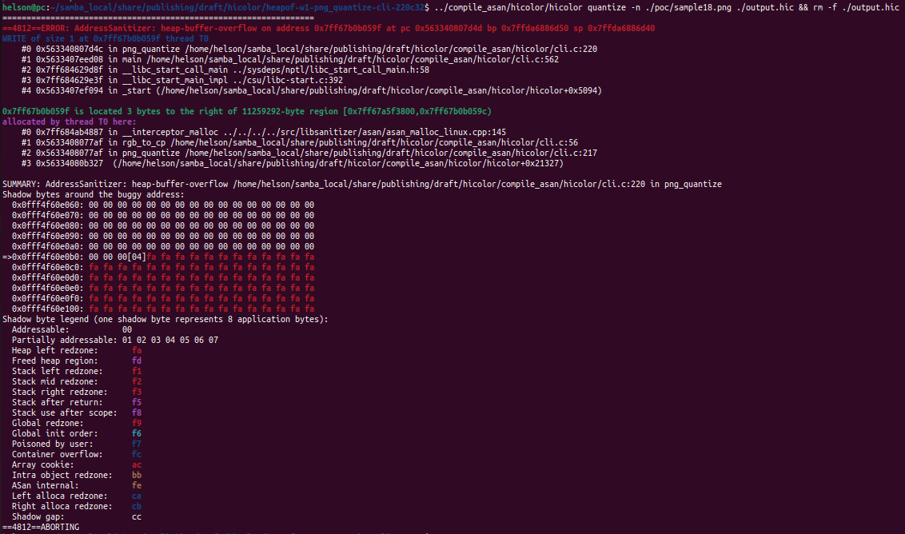

# Description

heap-buffer-overflow bug/vulnerability caused by write access found in function png_quantize() at line 220 of cli.c v1.05.


Affected version: hicolor v0.5.0


# Reproduction

Environment:


Operating system version: Ubuntu 22.04


Linux kernel version: Linux pc 5.19.0-41-generic #42~22.04.1-Ubuntu SMP PREEMPT_DYNAMIC Tue Apr 18 17:40:00 UTC 2 x86_64 x86_64 x86_64 GNU/Linux


Compiler version: gcc version 11.4.0 (Ubuntu 11.4.0-1ubuntu1~22.04)


Compile hicolor with ASAN and run the following command in bash shell:

```shell
hicolor quantize -n ./poc/sample18.png ./output.hic && rm -f ./output.hic
```


# Screen-shot




```shell
=================================================================
==4812==ERROR: AddressSanitizer: heap-buffer-overflow on address 0x7ff67b0b059f at pc 0x563340807d4d bp 0x7ffda6886d50 sp 0x7ffda6886d40
WRITE of size 1 at 0x7ff67b0b059f thread T0
    #0 0x563340807d4c in png_quantize /home/helson/samba_local/share/publishing/draft/hicolor/compile_asan/hicolor/cli.c:220
    #1 0x5633407eed08 in main /home/helson/samba_local/share/publishing/draft/hicolor/compile_asan/hicolor/cli.c:562
    #2 0x7ff684629d8f in __libc_start_call_main ../sysdeps/nptl/libc_start_call_main.h:58
    #3 0x7ff684629e3f in __libc_start_main_impl ../csu/libc-start.c:392
    #4 0x5633407ef094 in _start (/home/helson/samba_local/share/publishing/draft/hicolor/compile_asan/hicolor/hicolor+0x5094)

0x7ff67b0b059f is located 3 bytes to the right of 11259292-byte region [0x7ff67a5f3800,0x7ff67b0b059c)
allocated by thread T0 here:
    #0 0x7ff684ab4887 in __interceptor_malloc ../../../../src/libsanitizer/asan/asan_malloc_linux.cpp:145
    #1 0x5633408077af in rgb_to_cp /home/helson/samba_local/share/publishing/draft/hicolor/compile_asan/hicolor/cli.c:56
    #2 0x5633408077af in png_quantize /home/helson/samba_local/share/publishing/draft/hicolor/compile_asan/hicolor/cli.c:217
    #3 0x56334080b327  (/home/helson/samba_local/share/publishing/draft/hicolor/compile_asan/hicolor/hicolor+0x21327)

SUMMARY: AddressSanitizer: heap-buffer-overflow /home/helson/samba_local/share/publishing/draft/hicolor/compile_asan/hicolor/cli.c:220 in png_quantize
Shadow bytes around the buggy address:
  0x0fff4f60e060: 00 00 00 00 00 00 00 00 00 00 00 00 00 00 00 00
  0x0fff4f60e070: 00 00 00 00 00 00 00 00 00 00 00 00 00 00 00 00
  0x0fff4f60e080: 00 00 00 00 00 00 00 00 00 00 00 00 00 00 00 00
  0x0fff4f60e090: 00 00 00 00 00 00 00 00 00 00 00 00 00 00 00 00
  0x0fff4f60e0a0: 00 00 00 00 00 00 00 00 00 00 00 00 00 00 00 00
=>0x0fff4f60e0b0: 00 00 00[04]fa fa fa fa fa fa fa fa fa fa fa fa
  0x0fff4f60e0c0: fa fa fa fa fa fa fa fa fa fa fa fa fa fa fa fa
  0x0fff4f60e0d0: fa fa fa fa fa fa fa fa fa fa fa fa fa fa fa fa
  0x0fff4f60e0e0: fa fa fa fa fa fa fa fa fa fa fa fa fa fa fa fa
  0x0fff4f60e0f0: fa fa fa fa fa fa fa fa fa fa fa fa fa fa fa fa
  0x0fff4f60e100: fa fa fa fa fa fa fa fa fa fa fa fa fa fa fa fa
Shadow byte legend (one shadow byte represents 8 application bytes):
  Addressable:           00
  Partially addressable: 01 02 03 04 05 06 07 
  Heap left redzone:       fa
  Freed heap region:       fd
  Stack left redzone:      f1
  Stack mid redzone:       f2
  Stack right redzone:     f3
  Stack after return:      f5
  Stack use after scope:   f8
  Global redzone:          f9
  Global init order:       f6
  Poisoned by user:        f7
  Container overflow:      fc
  Array cookie:            ac
  Intra object redzone:    bb
  ASan internal:           fe
  Left alloca redzone:     ca
  Right alloca redzone:    cb
  Shadow gap:              cc
==4812==ABORTING

```

