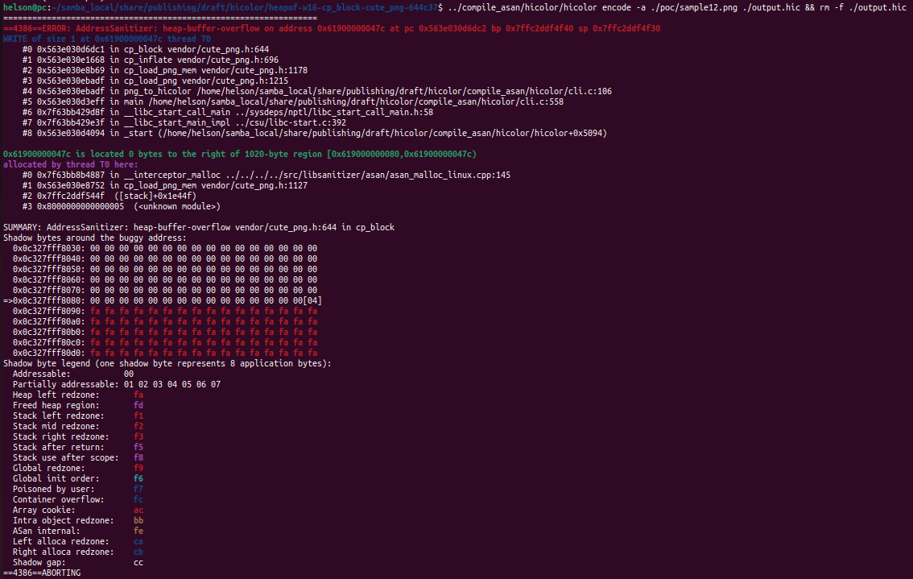
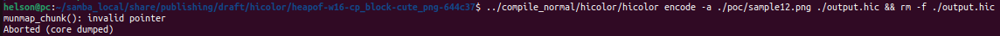
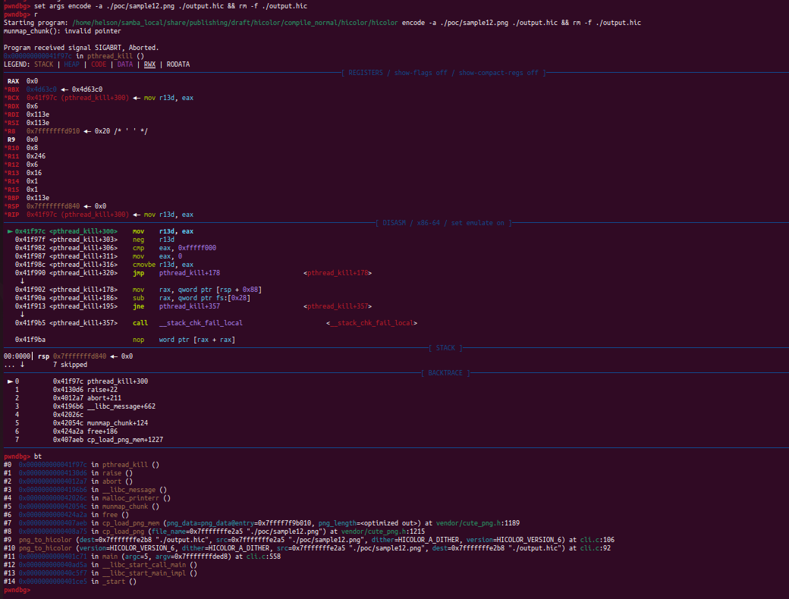

# Description

Heap-buffer-flow bug/vulnerability caused by write access found in function cp_block() at line 644 of vendor/cute_png.h v1.05. What's more, sample12.png provided as attack vector causes unmap invalid pointer memory corruption in function cp_load_png_mem() at line 1189 of vendor/cute_png.h v1.05.


Affected version: hicolor v0.5.0


# Reproduction

Environment:


Operating system version: Ubuntu 22.04


Linux kernel version: Linux pc 5.19.0-41-generic #42~22.04.1-Ubuntu SMP PREEMPT_DYNAMIC Tue Apr 18 17:40:00 UTC 2 x86_64 x86_64 x86_64 GNU/Linux


Compiler version: gcc version 11.4.0 (Ubuntu 11.4.0-1ubuntu1~22.04)


Compile hicolor with ASAN and run the following command in bash shell:

```shell
hicolor encode -a ./poc/sample12.png ./output.hic && rm -f ./output.hic
```


# Screen-shot

## heap-buffer-overflow




```shell
=================================================================
==4386==ERROR: AddressSanitizer: heap-buffer-overflow on address 0x61900000047c at pc 0x563e030d6dc2 bp 0x7ffc2ddf4f40 sp 0x7ffc2ddf4f30
WRITE of size 1 at 0x61900000047c thread T0
    #0 0x563e030d6dc1 in cp_block vendor/cute_png.h:644
    #1 0x563e030e1668 in cp_inflate vendor/cute_png.h:696
    #2 0x563e030e8b69 in cp_load_png_mem vendor/cute_png.h:1178
    #3 0x563e030ebadf in cp_load_png vendor/cute_png.h:1215
    #4 0x563e030ebadf in png_to_hicolor /home/helson/samba_local/share/publishing/draft/hicolor/compile_asan/hicolor/cli.c:106
    #5 0x563e030d3eff in main /home/helson/samba_local/share/publishing/draft/hicolor/compile_asan/hicolor/cli.c:558
    #6 0x7f63bb429d8f in __libc_start_call_main ../sysdeps/nptl/libc_start_call_main.h:58
    #7 0x7f63bb429e3f in __libc_start_main_impl ../csu/libc-start.c:392
    #8 0x563e030d4094 in _start (/home/helson/samba_local/share/publishing/draft/hicolor/compile_asan/hicolor/hicolor+0x5094)

0x61900000047c is located 0 bytes to the right of 1020-byte region [0x619000000080,0x61900000047c)
allocated by thread T0 here:
    #0 0x7f63bb8b4887 in __interceptor_malloc ../../../../src/libsanitizer/asan/asan_malloc_linux.cpp:145
    #1 0x563e030e8752 in cp_load_png_mem vendor/cute_png.h:1127
    #2 0x7ffc2ddf544f  ([stack]+0x1e44f)
    #3 0x8000000000000005  (<unknown module>)

SUMMARY: AddressSanitizer: heap-buffer-overflow vendor/cute_png.h:644 in cp_block
Shadow bytes around the buggy address:
  0x0c327fff8030: 00 00 00 00 00 00 00 00 00 00 00 00 00 00 00 00
  0x0c327fff8040: 00 00 00 00 00 00 00 00 00 00 00 00 00 00 00 00
  0x0c327fff8050: 00 00 00 00 00 00 00 00 00 00 00 00 00 00 00 00
  0x0c327fff8060: 00 00 00 00 00 00 00 00 00 00 00 00 00 00 00 00
  0x0c327fff8070: 00 00 00 00 00 00 00 00 00 00 00 00 00 00 00 00
=>0x0c327fff8080: 00 00 00 00 00 00 00 00 00 00 00 00 00 00 00[04]
  0x0c327fff8090: fa fa fa fa fa fa fa fa fa fa fa fa fa fa fa fa
  0x0c327fff80a0: fa fa fa fa fa fa fa fa fa fa fa fa fa fa fa fa
  0x0c327fff80b0: fa fa fa fa fa fa fa fa fa fa fa fa fa fa fa fa
  0x0c327fff80c0: fa fa fa fa fa fa fa fa fa fa fa fa fa fa fa fa
  0x0c327fff80d0: fa fa fa fa fa fa fa fa fa fa fa fa fa fa fa fa
Shadow byte legend (one shadow byte represents 8 application bytes):
  Addressable:           00
  Partially addressable: 01 02 03 04 05 06 07 
  Heap left redzone:       fa
  Freed heap region:       fd
  Stack left redzone:      f1
  Stack mid redzone:       f2
  Stack right redzone:     f3
  Stack after return:      f5
  Stack use after scope:   f8
  Global redzone:          f9
  Global init order:       f6
  Poisoned by user:        f7
  Container overflow:      fc
  Array cookie:            ac
  Intra object redzone:    bb
  ASan internal:           fe
  Left alloca redzone:     ca
  Right alloca redzone:    cb
  Shadow gap:              cc
==4386==ABORTING

```


## unmap invalid pointer







