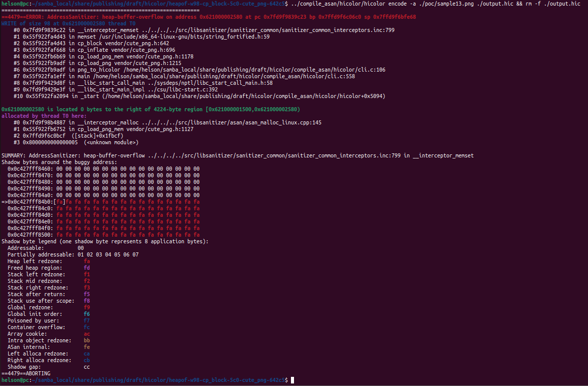
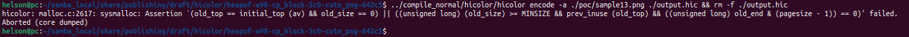

# Description

Heap-buffer-flow bug/vulnerability caused by write access found in function cp_block() at line 642 of vendor/cute_png.h v1.05.


Affected version: hicolor v0.5.0


# Reproduction

Environment:


Operating system version: Ubuntu 22.04


Linux kernel version: Linux pc 5.19.0-41-generic #42~22.04.1-Ubuntu SMP PREEMPT_DYNAMIC Tue Apr 18 17:40:00 UTC 2 x86_64 x86_64 x86_64 GNU/Linux


Compiler version: gcc version 11.4.0 (Ubuntu 11.4.0-1ubuntu1~22.04)


Compile hicolor with ASAN and run the following command in bash shell:

```shell
hicolor encode -a ./poc/sample13.png ./output.hic && rm -f ./output.hic
```


# Screen-shot







```shell
=================================================================
==4479==ERROR: AddressSanitizer: heap-buffer-overflow on address 0x621000002580 at pc 0x7fd9f9839c23 bp 0x7ffd9f6c06c0 sp 0x7ffd9f6bfe68
WRITE of size 98 at 0x621000002580 thread T0
    #0 0x7fd9f9839c22 in __interceptor_memset ../../../../src/libsanitizer/sanitizer_common/sanitizer_common_interceptors.inc:799
    #1 0x55f922fa4d43 in memset /usr/include/x86_64-linux-gnu/bits/string_fortified.h:59
    #2 0x55f922fa4d43 in cp_block vendor/cute_png.h:642
    #3 0x55f922faf668 in cp_inflate vendor/cute_png.h:696
    #4 0x55f922fb6b69 in cp_load_png_mem vendor/cute_png.h:1178
    #5 0x55f922fb9adf in cp_load_png vendor/cute_png.h:1215
    #6 0x55f922fb9adf in png_to_hicolor /home/helson/samba_local/share/publishing/draft/hicolor/compile_asan/hicolor/cli.c:106
    #7 0x55f922fa1eff in main /home/helson/samba_local/share/publishing/draft/hicolor/compile_asan/hicolor/cli.c:558
    #8 0x7fd9f9429d8f in __libc_start_call_main ../sysdeps/nptl/libc_start_call_main.h:58
    #9 0x7fd9f9429e3f in __libc_start_main_impl ../csu/libc-start.c:392
    #10 0x55f922fa2094 in _start (/home/helson/samba_local/share/publishing/draft/hicolor/compile_asan/hicolor/hicolor+0x5094)

0x621000002580 is located 0 bytes to the right of 4224-byte region [0x621000001500,0x621000002580)
allocated by thread T0 here:
    #0 0x7fd9f98b4887 in __interceptor_malloc ../../../../src/libsanitizer/asan/asan_malloc_linux.cpp:145
    #1 0x55f922fb6752 in cp_load_png_mem vendor/cute_png.h:1127
    #2 0x7ffd9f6c0bcf  ([stack]+0x1fbcf)
    #3 0x8000000000000005  (<unknown module>)

SUMMARY: AddressSanitizer: heap-buffer-overflow ../../../../src/libsanitizer/sanitizer_common/sanitizer_common_interceptors.inc:799 in __interceptor_memset
Shadow bytes around the buggy address:
  0x0c427fff8460: 00 00 00 00 00 00 00 00 00 00 00 00 00 00 00 00
  0x0c427fff8470: 00 00 00 00 00 00 00 00 00 00 00 00 00 00 00 00
  0x0c427fff8480: 00 00 00 00 00 00 00 00 00 00 00 00 00 00 00 00
  0x0c427fff8490: 00 00 00 00 00 00 00 00 00 00 00 00 00 00 00 00
  0x0c427fff84a0: 00 00 00 00 00 00 00 00 00 00 00 00 00 00 00 00
=>0x0c427fff84b0:[fa]fa fa fa fa fa fa fa fa fa fa fa fa fa fa fa
  0x0c427fff84c0: fa fa fa fa fa fa fa fa fa fa fa fa fa fa fa fa
  0x0c427fff84d0: fa fa fa fa fa fa fa fa fa fa fa fa fa fa fa fa
  0x0c427fff84e0: fa fa fa fa fa fa fa fa fa fa fa fa fa fa fa fa
  0x0c427fff84f0: fa fa fa fa fa fa fa fa fa fa fa fa fa fa fa fa
  0x0c427fff8500: fa fa fa fa fa fa fa fa fa fa fa fa fa fa fa fa
Shadow byte legend (one shadow byte represents 8 application bytes):
  Addressable:           00
  Partially addressable: 01 02 03 04 05 06 07 
  Heap left redzone:       fa
  Freed heap region:       fd
  Stack left redzone:      f1
  Stack mid redzone:       f2
  Stack right redzone:     f3
  Stack after return:      f5
  Stack use after scope:   f8
  Global redzone:          f9
  Global init order:       f6
  Poisoned by user:        f7
  Container overflow:      fc
  Array cookie:            ac
  Intra object redzone:    bb
  ASan internal:           fe
  Left alloca redzone:     ca
  Right alloca redzone:    cb
  Shadow gap:              cc
==4479==ABORTING

```

