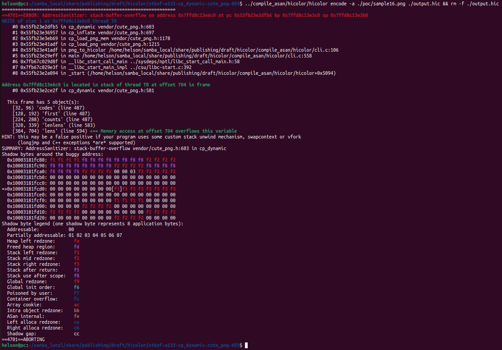
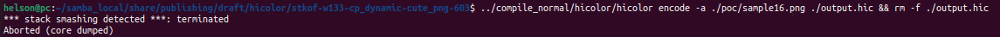

# Description

stack-buffer-overflow bug/vulnerability caused by write access found in function cp_dynamic() at line 603 of vendor/cute_png.h v1.05. It will lead to control flow hijacking.


Affected version: hicolor v0.5.0


# Reproduction

Environment:


Operating system version: Ubuntu 22.04


Linux kernel version: Linux pc 5.19.0-41-generic #42~22.04.1-Ubuntu SMP PREEMPT_DYNAMIC Tue Apr 18 17:40:00 UTC 2 x86_64 x86_64 x86_64 GNU/Linux


Compiler version: gcc version 11.4.0 (Ubuntu 11.4.0-1ubuntu1~22.04)


Compile hicolor with ASAN and run the following command in bash shell:

```shell
hicolor encode -a ./poc/sample16.png ./output.hic && rm -f ./output.hic
```


# Screen-shot







```shell
=================================================================
==4701==ERROR: AddressSanitizer: stack-buffer-overflow on address 0x7ffd8c13e6c0 at pc 0x55fb23e2dfb6 bp 0x7ffd8c13e3c0 sp 0x7ffd8c13e3b0
WRITE of size 1 at 0x7ffd8c13e6c0 thread T0
    #0 0x55fb23e2dfb5 in cp_dynamic vendor/cute_png.h:603
    #1 0x55fb23e36957 in cp_inflate vendor/cute_png.h:697
    #2 0x55fb23e3eb69 in cp_load_png_mem vendor/cute_png.h:1178
    #3 0x55fb23e41adf in cp_load_png vendor/cute_png.h:1215
    #4 0x55fb23e41adf in png_to_hicolor /home/helson/samba_local/share/publishing/draft/hicolor/compile_asan/hicolor/cli.c:106
    #5 0x55fb23e29eff in main /home/helson/samba_local/share/publishing/draft/hicolor/compile_asan/hicolor/cli.c:558
    #6 0x7fb67c029d8f in __libc_start_call_main ../sysdeps/nptl/libc_start_call_main.h:58
    #7 0x7fb67c029e3f in __libc_start_main_impl ../csu/libc-start.c:392
    #8 0x55fb23e2a094 in _start (/home/helson/samba_local/share/publishing/draft/hicolor/compile_asan/hicolor/hicolor+0x5094)

Address 0x7ffd8c13e6c0 is located in stack of thread T0 at offset 704 in frame
    #0 0x55fb23e2ce2f in cp_dynamic vendor/cute_png.h:581

  This frame has 5 object(s):
    [32, 96) 'codes' (line 487)
    [128, 192) 'first' (line 487)
    [224, 288) 'counts' (line 487)
    [320, 339) 'lenlens' (line 583)
    [384, 704) 'lens' (line 594) <== Memory access at offset 704 overflows this variable
HINT: this may be a false positive if your program uses some custom stack unwind mechanism, swapcontext or vfork
      (longjmp and C++ exceptions *are* supported)
SUMMARY: AddressSanitizer: stack-buffer-overflow vendor/cute_png.h:603 in cp_dynamic
Shadow bytes around the buggy address:
  0x10003181fc80: f1 f1 f1 f1 f8 f8 f8 f8 f8 f8 f8 f8 f2 f2 f2 f2
  0x10003181fc90: f8 f8 f8 f8 f8 f8 f8 f8 f2 f2 f2 f2 f8 f8 f8 f8
  0x10003181fca0: f8 f8 f8 f8 f2 f2 f2 f2 00 00 03 f2 f2 f2 f2 f2
  0x10003181fcb0: 00 00 00 00 00 00 00 00 00 00 00 00 00 00 00 00
  0x10003181fcc0: 00 00 00 00 00 00 00 00 00 00 00 00 00 00 00 00
=>0x10003181fcd0: 00 00 00 00 00 00 00 00[f3]f3 f3 f3 f3 f3 f3 f3
  0x10003181fce0: 00 00 00 00 00 00 00 00 00 00 00 00 00 00 00 00
  0x10003181fcf0: 00 00 00 00 00 00 00 00 f1 f1 f1 f1 00 00 00 00
  0x10003181fd00: 00 00 00 00 f2 f2 f2 f2 00 00 00 00 00 00 00 00
  0x10003181fd10: f2 f2 f2 f2 00 00 00 00 00 00 00 00 f2 f2 f2 f2
  0x10003181fd20: 00 00 00 00 00 00 00 00 f2 f2 f2 f2 00 00 00 00
Shadow byte legend (one shadow byte represents 8 application bytes):
  Addressable:           00
  Partially addressable: 01 02 03 04 05 06 07 
  Heap left redzone:       fa
  Freed heap region:       fd
  Stack left redzone:      f1
  Stack mid redzone:       f2
  Stack right redzone:     f3
  Stack after return:      f5
  Stack use after scope:   f8
  Global redzone:          f9
  Global init order:       f6
  Poisoned by user:        f7
  Container overflow:      fc
  Array cookie:            ac
  Intra object redzone:    bb
  ASan internal:           fe
  Left alloca redzone:     ca
  Right alloca redzone:    cb
  Shadow gap:              cc
==4701==ABORTING

```

