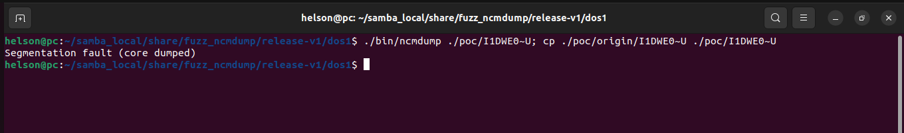
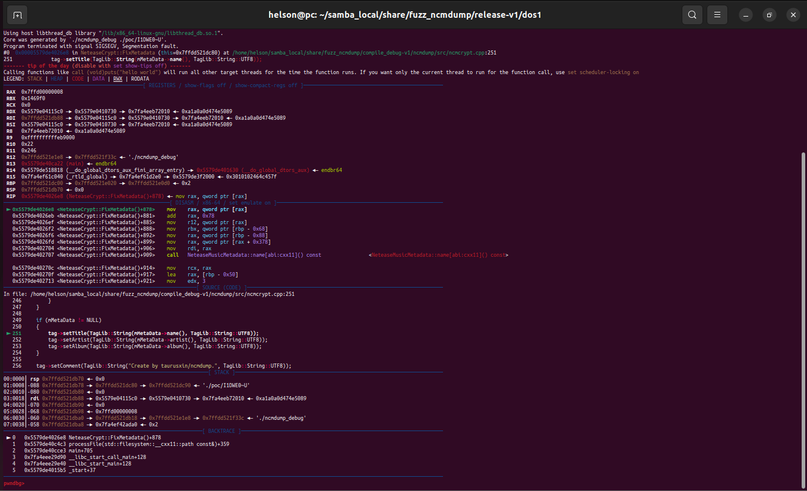

# Description

Denial-of-Service (DoS) Vulnerability of taurusxin ncmdump v1.3.2 allow a remote attacker to break ncmdump online service via the crafted .ncm files.


Attack vectors provided in poc will trigger segmentation fault caused by illegal read access. The crash point is at ncmdump/src/ncmcrypt.cpp:251, a function call to NeteaseCrypt::FixMetadata(). Coredump file is provided in ./coredumps.


# Reproduction

Run the following command:

```shell
./bin/ncmdump ./poc/I1DWE0~U; cp ./poc/origin/I1DWE0~U ./poc/I1DWE0~U
```

Postscript: To successfully reproduce it, one need to run the command for several times.


# Screen-shot

Crash:




Debug coredump:


