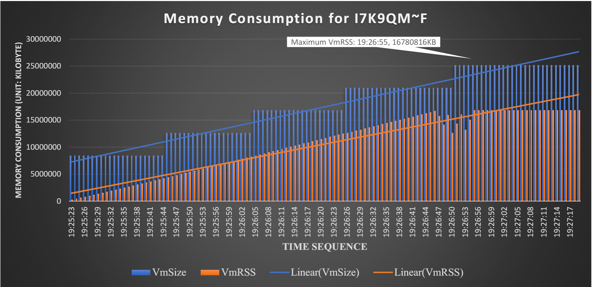
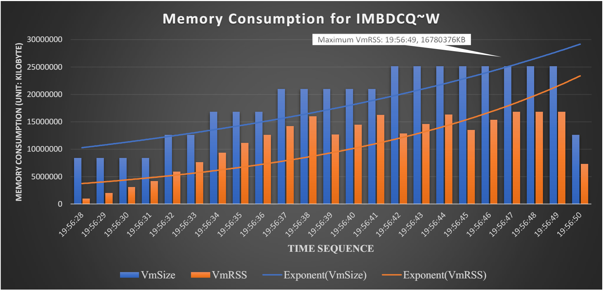
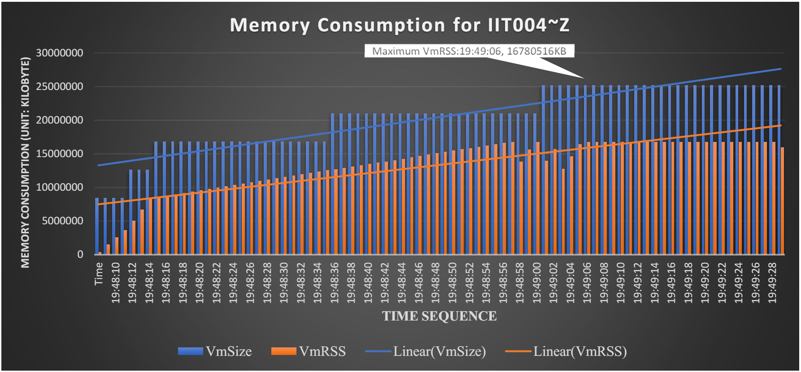
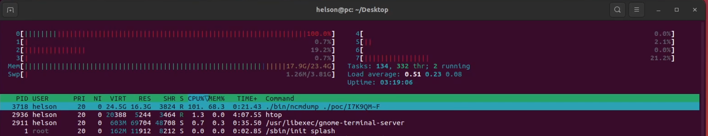

# Description

Denial-of-Service (DoS) vulnerability of taurusxin ncmdump v1.3.2 allow a remote attacker to flood a server with extremely high memory consumption to prevent user from accessing services via the crafted .ncm files.


One crafted .ncm file with a file size of 440KB can consume 16.3GB physical memory in 23 seconds. Memory resource consumption is amplified by 38183 times the file size.


Attacker can take down state-of-the-art cloud server on sale in HUAWEI (which has 4096GB virtual memory) by sending no more than 256 files. In other words, it is easy for attacker to launch DoS attack to mainstream servers with ncmdump service on it.


Besides, attack vectors provided in poc also trigger segmentation fault to increase the probability of successful attack.


# Reproduction

run the following command:

```
./bin/ncmdump ./poc/I7K9QM~F; cp ./poc/origin/I7K9QM~F ./poc/I7K9QM~F
```


# Recommendation for Temporary Patch

Servers with ncmdump service should set memory limit for running process to prevent memory exhausted.


# More details

I collect the memory consumption data with collectl and /bin/time. See raw data in ./resource_consumption_statistics.


I have processed the raw data to bar charts shown in Screen-shot below.


# Screen-shot













A demonstration video is available ./resource_consumption_statistics/demo_video