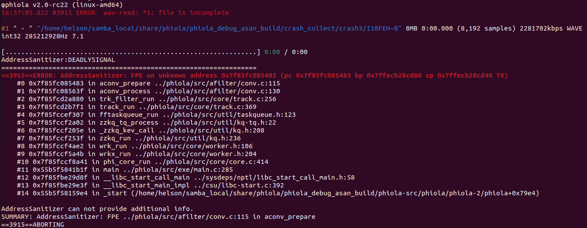

# Description

There is a flow point exception in phiola/src/afilter/conv.c:115 which may lead to denial of service.


Affected version: v2.0-rc22


# Reproduction

run the following command:

```shell
phiola convert poc -vorbis_q 7 -o ./file.ogg && rm -f ./file.ogg
```


# screen-shot




```shell
φphiola v2.0-rc22 (linux-amd64)
16:37:05.822 #3915 ERROR  wav-read: *1: file is incomplete

#1 " - " "/home/helson/samba_local/share/phiola/phiola_debug_asan_build/crash_collect/crash3/I10FEH~8" 0MB 0:00.000 (8,192 samples) 2281702kbps WAVE int32 285212928Hz 7.1

[................................................................] 0:00 / 0:00
AddressSanitizer:DEADLYSIGNAL
=================================================================
==3915==ERROR: AddressSanitizer: FPE on unknown address 0x7f85fc085483 (pc 0x7f85fc085483 bp 0x7ffecb28cd80 sp 0x7ffecb28cd40 T0)
    #0 0x7f85fc085483 in aconv_prepare ../phiola/src/afilter/conv.c:115
    #1 0x7f85fc08563f in aconv_process ../phiola/src/afilter/conv.c:130
    #2 0x7f85fcd2a880 in trk_filter_run ../phiola/src/core/track.c:256
    #3 0x7f85fcd2b7f1 in track_run ../phiola/src/core/track.c:369
    #4 0x7f85fccef307 in fftaskqueue_run ../phiola/src/util/taskqueue.h:123
    #5 0x7f85fccf2a02 in zzkq_tq_process ../phiola/src/util/kq-tq.h:22
    #6 0x7f85fccf205e in _zzkq_kev_call ../phiola/src/util/kq.h:208
    #7 0x7f85fccf253f in zzkq_run ../phiola/src/util/kq.h:236
    #8 0x7f85fccf4ae2 in wrk_run ../phiola/src/core/worker.h:106
    #9 0x7f85fccf5a4b in wrkx_run ../phiola/src/core/worker.h:204
    #10 0x7f85fccf8a41 in phi_core_run ../phiola/src/core/core.c:414
    #11 0x55b5f5841b1f in main ../phiola/src/exe/main.c:285
    #12 0x7f85fbe29d8f in __libc_start_call_main ../sysdeps/nptl/libc_start_call_main.h:58
    #13 0x7f85fbe29e3f in __libc_start_main_impl ../csu/libc-start.c:392
    #14 0x55b5f58159e4 in _start (/home/helson/samba_local/share/phiola/phiola_debug_asan_build/phiola-src/phiola/phiola-2/phiola+0x79e4)

AddressSanitizer can not provide additional info.
SUMMARY: AddressSanitizer: FPE ../phiola/src/afilter/conv.c:115 in aconv_prepare
==3915==ABORTING

```

