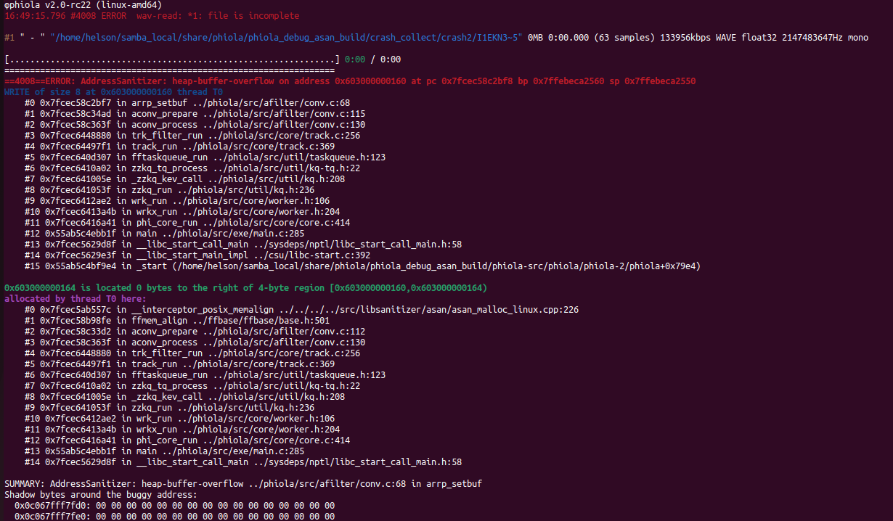

# Descirption

There is a Heap-Buffer-Overflow vulnerability in ./phiola/src/afilter/conv.c:68 which damaged data integrity.


Affected version: v2.0-rc22


# Reproduction

run the following command:

```shell
phiola convert poc -vorbis_q 7 -o ./file.ogg && rm -f ./file.ogg
```


# Screen-shot




```shell
φphiola v2.0-rc22 (linux-amd64)
16:49:15.796 #4008 ERROR  wav-read: *1: file is incomplete

#1 " - " "/home/helson/samba_local/share/phiola/phiola_debug_asan_build/crash_collect/crash2/I1EKN3~5" 0MB 0:00.000 (63 samples) 133956kbps WAVE float32 2147483647Hz mono

[................................................................] 0:00 / 0:00
=================================================================
==4008==ERROR: AddressSanitizer: heap-buffer-overflow on address 0x603000000160 at pc 0x7fcec58c2bf8 bp 0x7ffebeca2560 sp 0x7ffebeca2550
WRITE of size 8 at 0x603000000160 thread T0
    #0 0x7fcec58c2bf7 in arrp_setbuf ../phiola/src/afilter/conv.c:68
    #1 0x7fcec58c34ad in aconv_prepare ../phiola/src/afilter/conv.c:115
    #2 0x7fcec58c363f in aconv_process ../phiola/src/afilter/conv.c:130
    #3 0x7fcec6448880 in trk_filter_run ../phiola/src/core/track.c:256
    #4 0x7fcec64497f1 in track_run ../phiola/src/core/track.c:369
    #5 0x7fcec640d307 in fftaskqueue_run ../phiola/src/util/taskqueue.h:123
    #6 0x7fcec6410a02 in zzkq_tq_process ../phiola/src/util/kq-tq.h:22
    #7 0x7fcec641005e in _zzkq_kev_call ../phiola/src/util/kq.h:208
    #8 0x7fcec641053f in zzkq_run ../phiola/src/util/kq.h:236
    #9 0x7fcec6412ae2 in wrk_run ../phiola/src/core/worker.h:106
    #10 0x7fcec6413a4b in wrkx_run ../phiola/src/core/worker.h:204
    #11 0x7fcec6416a41 in phi_core_run ../phiola/src/core/core.c:414
    #12 0x55ab5c4ebb1f in main ../phiola/src/exe/main.c:285
    #13 0x7fcec5629d8f in __libc_start_call_main ../sysdeps/nptl/libc_start_call_main.h:58
    #14 0x7fcec5629e3f in __libc_start_main_impl ../csu/libc-start.c:392
    #15 0x55ab5c4bf9e4 in _start (/home/helson/samba_local/share/phiola/phiola_debug_asan_build/phiola-src/phiola/phiola-2/phiola+0x79e4)

0x603000000164 is located 0 bytes to the right of 4-byte region [0x603000000160,0x603000000164)
allocated by thread T0 here:
    #0 0x7fcec5ab557c in __interceptor_posix_memalign ../../../../src/libsanitizer/asan/asan_malloc_linux.cpp:226
    #1 0x7fcec58b98fe in ffmem_align ../ffbase/ffbase/base.h:501
    #2 0x7fcec58c33d2 in aconv_prepare ../phiola/src/afilter/conv.c:112
    #3 0x7fcec58c363f in aconv_process ../phiola/src/afilter/conv.c:130
    #4 0x7fcec6448880 in trk_filter_run ../phiola/src/core/track.c:256
    #5 0x7fcec64497f1 in track_run ../phiola/src/core/track.c:369
    #6 0x7fcec640d307 in fftaskqueue_run ../phiola/src/util/taskqueue.h:123
    #7 0x7fcec6410a02 in zzkq_tq_process ../phiola/src/util/kq-tq.h:22
    #8 0x7fcec641005e in _zzkq_kev_call ../phiola/src/util/kq.h:208
    #9 0x7fcec641053f in zzkq_run ../phiola/src/util/kq.h:236
    #10 0x7fcec6412ae2 in wrk_run ../phiola/src/core/worker.h:106
    #11 0x7fcec6413a4b in wrkx_run ../phiola/src/core/worker.h:204
    #12 0x7fcec6416a41 in phi_core_run ../phiola/src/core/core.c:414
    #13 0x55ab5c4ebb1f in main ../phiola/src/exe/main.c:285
    #14 0x7fcec5629d8f in __libc_start_call_main ../sysdeps/nptl/libc_start_call_main.h:58

SUMMARY: AddressSanitizer: heap-buffer-overflow ../phiola/src/afilter/conv.c:68 in arrp_setbuf
Shadow bytes around the buggy address:
  0x0c067fff7fd0: 00 00 00 00 00 00 00 00 00 00 00 00 00 00 00 00
  0x0c067fff7fe0: 00 00 00 00 00 00 00 00 00 00 00 00 00 00 00 00
  0x0c067fff7ff0: 00 00 00 00 00 00 00 00 00 00 00 00 00 00 00 00
  0x0c067fff8000: fa fa fd fd fd fa fa fa 00 00 04 fa fa fa 00 00
  0x0c067fff8010: 04 fa fa fa 00 00 04 fa fa fa 00 00 00 00 fa fa
=>0x0c067fff8020: fd fd fd fa fa fa fd fd fd fa fa fa[04]fa fa fa
  0x0c067fff8030: fa fa fa fa fa fa fa fa fa fa fa fa fa fa fa fa
  0x0c067fff8040: fa fa fa fa fa fa fa fa fa fa fa fa fa fa fa fa
  0x0c067fff8050: fa fa fa fa fa fa fa fa fa fa fa fa fa fa fa fa
  0x0c067fff8060: fa fa fa fa fa fa fa fa fa fa fa fa fa fa fa fa
  0x0c067fff8070: fa fa fa fa fa fa fa fa fa fa fa fa fa fa fa fa
Shadow byte legend (one shadow byte represents 8 application bytes):
  Addressable:           00
  Partially addressable: 01 02 03 04 05 06 07 
  Heap left redzone:       fa
  Freed heap region:       fd
  Stack left redzone:      f1
  Stack mid redzone:       f2
  Stack right redzone:     f3
  Stack after return:      f5
  Stack use after scope:   f8
  Global redzone:          f9
  Global init order:       f6
  Poisoned by user:        f7
  Container overflow:      fc
  Array cookie:            ac
  Intra object redzone:    bb
  ASan internal:           fe
  Left alloca redzone:     ca
  Right alloca redzone:    cb
  Shadow gap:              cc
==4008==ABORTING
```

