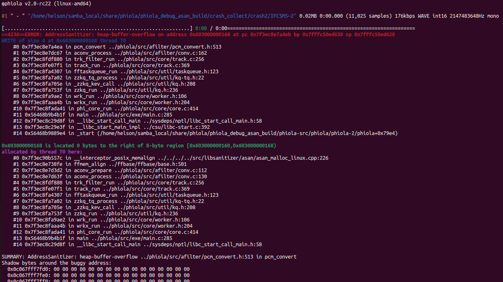

# Descirption

There is a Heap-Buffer-Overflow vulnerability in phiola/src/afilter/pcm_convert.h:513 which damaged data integrity.


Affected version: v2.0-rc22


# Reproduction

run the following command:

```shell
phiola convert poc -vorbis_q 7 -o ./file.ogg && rm -f ./file.ogg
```


# Screen-shot




```shell
φphiola v2.0-rc22 (linux-amd64)

#1 " - " "/home/helson/samba_local/share/phiola/phiola_debug_asan_build/crash_collect/crash2/IFC5M5~2" 0.02MB 0:00.000 (11,025 samples) 176kbps WAVE int16 2147483648Hz mono

[................................................................] 0:00 / 0:00=================================================================
==4236==ERROR: AddressSanitizer: heap-buffer-overflow on address 0x603000000168 at pc 0x7f3ec8e7a4eb bp 0x7fffc50ed630 sp 0x7fffc50ed620
WRITE of size 4 at 0x603000000168 thread T0
    #0 0x7f3ec8e7a4ea in pcm_convert ../phiola/src/afilter/pcm_convert.h:513
    #1 0x7f3ec8e7dc67 in aconv_process ../phiola/src/afilter/conv.c:162
    #2 0x7f3ec8fdf880 in trk_filter_run ../phiola/src/core/track.c:256
    #3 0x7f3ec8fe07f1 in track_run ../phiola/src/core/track.c:369
    #4 0x7f3ec8fa4307 in fftaskqueue_run ../phiola/src/util/taskqueue.h:123
    #5 0x7f3ec8fa7a02 in zzkq_tq_process ../phiola/src/util/kq-tq.h:22
    #6 0x7f3ec8fa705e in _zzkq_kev_call ../phiola/src/util/kq.h:208
    #7 0x7f3ec8fa753f in zzkq_run ../phiola/src/util/kq.h:236
    #8 0x7f3ec8fa9ae2 in wrk_run ../phiola/src/core/worker.h:106
    #9 0x7f3ec8faaa4b in wrkx_run ../phiola/src/core/worker.h:204
    #10 0x7f3ec8fada41 in phi_core_run ../phiola/src/core/core.c:414
    #11 0x56468b9b4b1f in main ../phiola/src/exe/main.c:285
    #12 0x7f3ec8c29d8f in __libc_start_call_main ../sysdeps/nptl/libc_start_call_main.h:58
    #13 0x7f3ec8c29e3f in __libc_start_main_impl ../csu/libc-start.c:392
    #14 0x56468b9889e4 in _start (/home/helson/samba_local/share/phiola/phiola_debug_asan_build/phiola-src/phiola/phiola-2/phiola+0x79e4)

0x603000000168 is located 0 bytes to the right of 8-byte region [0x603000000160,0x603000000168)
allocated by thread T0 here:
    #0 0x7f3ec90b557c in __interceptor_posix_memalign ../../../../src/libsanitizer/asan/asan_malloc_linux.cpp:226
    #1 0x7f3ec8e738fe in ffmem_align ../ffbase/ffbase/base.h:501
    #2 0x7f3ec8e7d3d2 in aconv_prepare ../phiola/src/afilter/conv.c:112
    #3 0x7f3ec8e7d63f in aconv_process ../phiola/src/afilter/conv.c:130
    #4 0x7f3ec8fdf880 in trk_filter_run ../phiola/src/core/track.c:256
    #5 0x7f3ec8fe07f1 in track_run ../phiola/src/core/track.c:369
    #6 0x7f3ec8fa4307 in fftaskqueue_run ../phiola/src/util/taskqueue.h:123
    #7 0x7f3ec8fa7a02 in zzkq_tq_process ../phiola/src/util/kq-tq.h:22
    #8 0x7f3ec8fa705e in _zzkq_kev_call ../phiola/src/util/kq.h:208
    #9 0x7f3ec8fa753f in zzkq_run ../phiola/src/util/kq.h:236
    #10 0x7f3ec8fa9ae2 in wrk_run ../phiola/src/core/worker.h:106
    #11 0x7f3ec8faaa4b in wrkx_run ../phiola/src/core/worker.h:204
    #12 0x7f3ec8fada41 in phi_core_run ../phiola/src/core/core.c:414
    #13 0x56468b9b4b1f in main ../phiola/src/exe/main.c:285
    #14 0x7f3ec8c29d8f in __libc_start_call_main ../sysdeps/nptl/libc_start_call_main.h:58

SUMMARY: AddressSanitizer: heap-buffer-overflow ../phiola/src/afilter/pcm_convert.h:513 in pcm_convert
Shadow bytes around the buggy address:
  0x0c067fff7fd0: 00 00 00 00 00 00 00 00 00 00 00 00 00 00 00 00
  0x0c067fff7fe0: 00 00 00 00 00 00 00 00 00 00 00 00 00 00 00 00
  0x0c067fff7ff0: 00 00 00 00 00 00 00 00 00 00 00 00 00 00 00 00
  0x0c067fff8000: fa fa fd fd fd fa fa fa 00 00 04 fa fa fa 00 00
  0x0c067fff8010: 04 fa fa fa 00 00 04 fa fa fa 00 00 00 00 fa fa
=>0x0c067fff8020: fd fd fd fa fa fa fd fd fd fa fa fa 00[fa]fa fa
  0x0c067fff8030: fa fa fa fa fa fa fa fa fa fa fa fa fa fa fa fa
  0x0c067fff8040: fa fa fa fa fa fa fa fa fa fa fa fa fa fa fa fa
  0x0c067fff8050: fa fa fa fa fa fa fa fa fa fa fa fa fa fa fa fa
  0x0c067fff8060: fa fa fa fa fa fa fa fa fa fa fa fa fa fa fa fa
  0x0c067fff8070: fa fa fa fa fa fa fa fa fa fa fa fa fa fa fa fa
Shadow byte legend (one shadow byte represents 8 application bytes):
  Addressable:           00
  Partially addressable: 01 02 03 04 05 06 07 
  Heap left redzone:       fa
  Freed heap region:       fd
  Stack left redzone:      f1
  Stack mid redzone:       f2
  Stack right redzone:     f3
  Stack after return:      f5
  Stack use after scope:   f8
  Global redzone:          f9
  Global init order:       f6
  Poisoned by user:        f7
  Container overflow:      fc
  Array cookie:            ac
  Intra object redzone:    bb
  ASan internal:           fe
  Left alloca redzone:     ca
  Right alloca redzone:    cb
  Shadow gap:              cc
==4236==ABORTING

```

