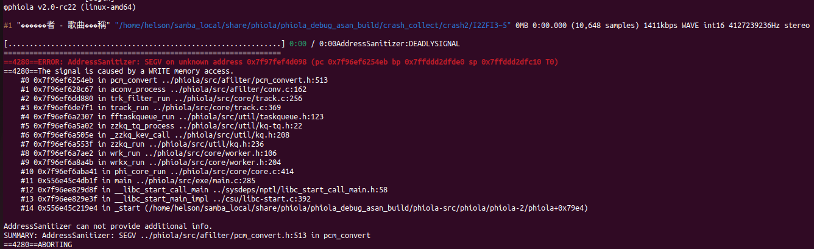

# Description

There is a segment fault vulnerability in phiola/src/afilter/pcm_convert.h:513 which may cause denial of service.


Affected version: v2.0-rc22


# Reproduction

run the following command:

```shell
phiola convert poc -vorbis_q 7 -o ./file.ogg && rm -f ./file.ogg
```


# Screen-shot




```shell
φphiola v2.0-rc22 (linux-amd64)

#1 "������者 - 歌曲���稱" "/home/helson/samba_local/share/phiola/phiola_debug_asan_build/crash_collect/crash2/I2ZFI3~5" 0MB 0:00.000 (10,648 samples) 1411kbps WAVE int16 4127239236Hz stereo

[................................................................] 0:00 / 0:00AddressSanitizer:DEADLYSIGNAL
=================================================================
==4280==ERROR: AddressSanitizer: SEGV on unknown address 0x7f97fef4d098 (pc 0x7f96ef6254eb bp 0x7ffddd2dfde0 sp 0x7ffddd2dfc10 T0)
==4280==The signal is caused by a WRITE memory access.
    #0 0x7f96ef6254eb in pcm_convert ../phiola/src/afilter/pcm_convert.h:513
    #1 0x7f96ef628c67 in aconv_process ../phiola/src/afilter/conv.c:162
    #2 0x7f96ef6dd880 in trk_filter_run ../phiola/src/core/track.c:256
    #3 0x7f96ef6de7f1 in track_run ../phiola/src/core/track.c:369
    #4 0x7f96ef6a2307 in fftaskqueue_run ../phiola/src/util/taskqueue.h:123
    #5 0x7f96ef6a5a02 in zzkq_tq_process ../phiola/src/util/kq-tq.h:22
    #6 0x7f96ef6a505e in _zzkq_kev_call ../phiola/src/util/kq.h:208
    #7 0x7f96ef6a553f in zzkq_run ../phiola/src/util/kq.h:236
    #8 0x7f96ef6a7ae2 in wrk_run ../phiola/src/core/worker.h:106
    #9 0x7f96ef6a8a4b in wrkx_run ../phiola/src/core/worker.h:204
    #10 0x7f96ef6aba41 in phi_core_run ../phiola/src/core/core.c:414
    #11 0x556e45c4db1f in main ../phiola/src/exe/main.c:285
    #12 0x7f96ee829d8f in __libc_start_call_main ../sysdeps/nptl/libc_start_call_main.h:58
    #13 0x7f96ee829e3f in __libc_start_main_impl ../csu/libc-start.c:392
    #14 0x556e45c219e4 in _start (/home/helson/samba_local/share/phiola/phiola_debug_asan_build/phiola-src/phiola/phiola-2/phiola+0x79e4)

AddressSanitizer can not provide additional info.
SUMMARY: AddressSanitizer: SEGV ../phiola/src/afilter/pcm_convert.h:513 in pcm_convert

```

